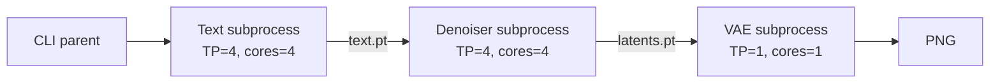
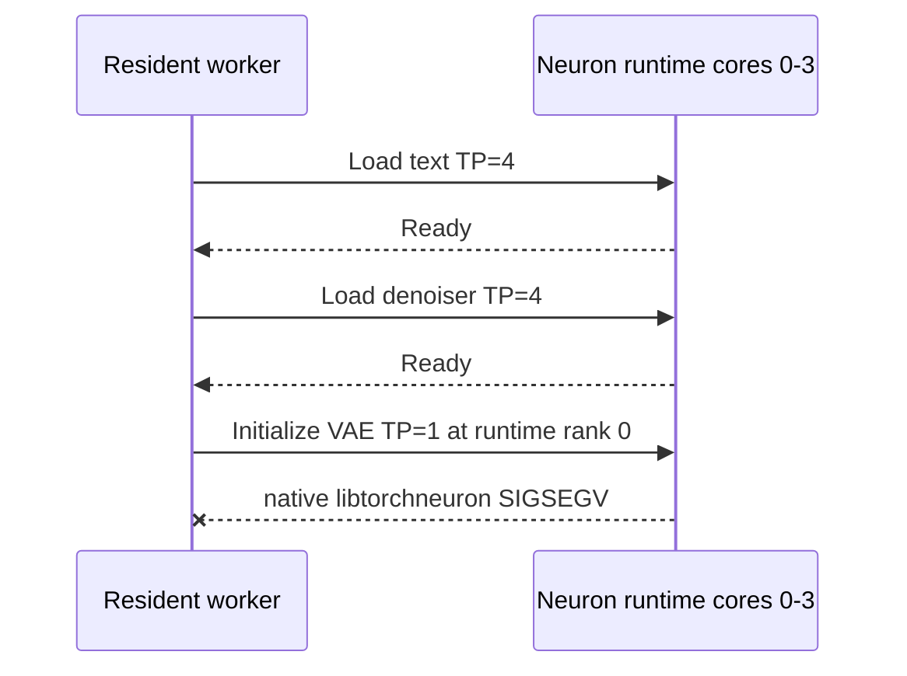

# Architecture and Lifecycle

## Current staged CLI

The CLI intentionally starts one subprocess per stage because the process-level Neuron core setting is fixed before runtime initialization. See `difflet/cli/orchestrators/qwen_image.py` and `difflet/cli/runner.py`.

Each child exits before the next starts, so peak core demand is four rather than nine. The tradeoff is repeated process/runtime/model initialization.

## Current resident serving attempt

`QwenImageServingOrchestrator.load()` resolves one model directory and loads text, denoiser, then VAE applications in one worker. The worker reserves four cores for the process.

The failure occurs during `nxd_model.initialize(weights, start_rank_tensor)` in `difflet/backends/trainium/core/application_base.py`, not during artifact lookup or compilation.

## Validated serial shared-core topology

One process reserves cores 0-3 and all three serving artifacts remain loaded at TP=4. The offline CLI keeps its separate TP=1 VAE artifact, but resident serving uses a dedicated TP=4 VAE artifact to avoid changing NxD world size inside the process.

The VAE does not contain tensor-parallel layers, so TP=4 behaves as four rank copies rather than an efficient convolutional tensor split. This consumes more HBM, but keeps a single NxD world size and removes decoder process cold starts.

## Data flow

The resident orchestrator already keeps inter-stage values in memory:

- Text stage returns `encoder_hidden_states` and mask.
- Denoiser returns packed CPU latents.
- Decoder reshapes and normalizes those latents before executing the VAE.

No `torch.distributed` gather is currently required. NxD TP=4 is represented by one Python process controlling a four-rank traced model, not four OS processes launched with `torchrun`. The proposed `if dist.get_rank() == 0` design therefore does not match the current serving runtime.

## Shutdown and failure behavior

The resident engine treats worker death during startup as a readiness failure. Readiness opens only after all three artifacts load and a real four-step generation smoke returns image bytes. Python object assignment to `None` is not a validated Neuron unload mechanism; core reservation ends when the worker process exits.
