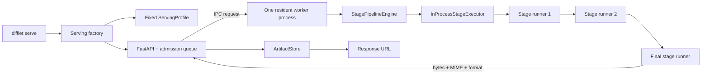
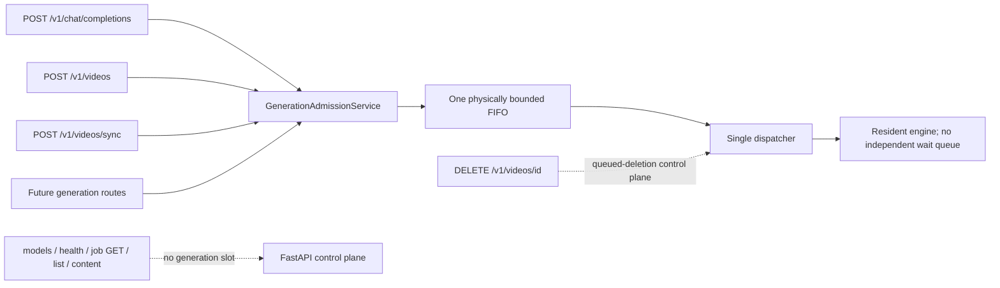
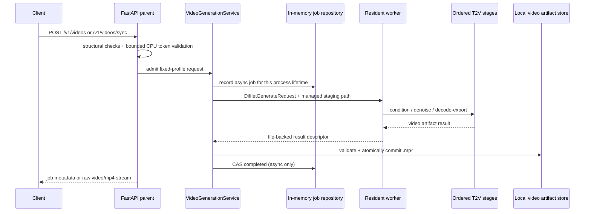
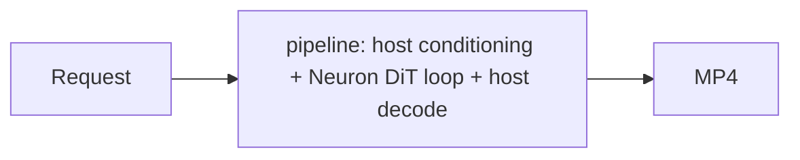
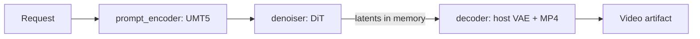
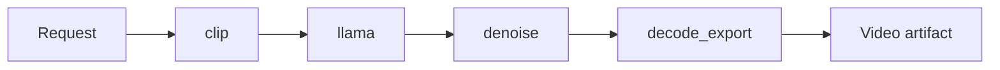

# T2V Serving Architecture and Lifecycle

## Existing T2I control flow

The current server already separates HTTP admission from a single resident
model worker:

The worker handles one request at a time. Other admitted requests wait in the
parent queue. `pending_requests` is the total accepted but not terminal count:
`running_requests + queued_requests`; it is not a third execution queue.

The generic traversal is in
`difflet/serving/engines/stage_pipeline.py`. Model-specific code supplies ordered
stage definitions, strongly typed payloads, loaded runners, smoke validation,
and final serialization.

## Global FastAPI admission invariant

> **Partially implemented architecture.** Video sync/async sharing, the bounded
> validation domain, and queued-only dispatch/delete claim are present locally.
> Generalizing the owner across concurrently registered Chat and Videos routes
> remains a release follow-up.

One serve process and its resident engine must have exactly one generation
admission owner. This is broader than the currently implemented video-only
sharing: every FastAPI route that can invoke the same resident engine must
receive one monotonically ordered admission ticket and enter the same bounded
FIFO and capacity budget.

The frozen constraints are:

1. Capacity counts `reserved/creating + queued + running` across endpoint types;
   P0 permits one running generation.
2. Cheap structural parsing happens before admission. CPU-only token-bucket
   validation also remains pre-admission, but every validator preloads its
   tokenizer during lifespan startup and runs request tokenization on a
   physically bounded validation executor rather than the FastAPI event loop.
   P0 defaults to four synchronous CPU validation workers and 32 waiting
   validation entries; model generation still has exactly one running request.
   Each validator call is synchronous inside an executor thread while
   FastAPI awaits its future asynchronously.
   A full validation domain rejects
   immediately with `429 validation_capacity_exhausted`; validation has a
   30-second sub-deadline and returns `504 validation_timeout`. Video queue
   wait and execution use separate clocks after validation: the shared video
   FIFO defaults to a 24-hour wait limit, and the request execution timeout
   starts only after the dispatcher claims the item. Tokenizers
   are vocabulary/rule data, not model weights or Neuron work. Invalid requests
   receive `400` and never consume a generation ticket. Capacity follows
   executor work rather than the HTTP waiter: after timeout or disconnect,
   started validation retains its running slot until the future ends; unstarted
   work releases a waiting slot only after successful atomic queue removal,
   otherwise it retains capacity through executor completion.
   These four workers are threads in one dedicated lifespan-owned executor in
   the FastAPI parent, not Uvicorn processes or resident model workers.
3. Only the global dispatcher may call `engine.generate`; the engine's own
   waiting capacity is zero so there is no second queue or second queue timeout.
4. FIFO order is defined at one linearization point: after cheap validation,
   the admission lock assigns a monotonically increasing ticket and reserves a
   slot. Enqueue timing after asynchronous job-record creation must not reorder
   tickets.
   The dispatcher and queued DELETE use this same lock. Dispatcher atomically
   dequeues, claims ownership, and performs `queued -> in_progress`; DELETE
   either removes/releases the queued item first or observes the claim and
   returns `409 video_in_progress`. Sync disconnect uses the same boundary.
5. Both the logical live-work count and the physical queue are bounded.
   Cancelled tombstones must be removed/compacted, or retain their slot until
   dequeued, so repeated enqueue/cancel traffic cannot grow memory without
   bound.
6. Queue accounting starts from the same admission point for sync and async
   Video. The default queue timeout is 86,400 seconds. Expiration atomically
   removes the item from the FIFO, marks an async job `failed` with
   `queue_timeout`, and releases every admission/storage reservation; it can
   never execute afterward. The generation timeout starts on the atomic
   `queued -> in_progress` claim. Strict FIFO deliberately accepts
   head-of-line blocking; endpoint quotas or priorities would require a
   different scheduler.
7. Status, list, content, model, and health reads bypass generation admission.
   DELETE also bypasses the generation FIFO: it removes queued work, returns
   `409 video_in_progress` for running work without signalling cancellation,
   and deletes terminal metadata/artifacts.
8. The queue is process-local to one resident engine. Difflet runs one Uvicorn
   worker for this ownership model; multiple API processes would require an
   external/shared admission coordinator.
9. Async admission atomically reserves one job-record slot before creation.
   The configurable P0 default cap is 4,096 records across queued, running,
   completed, and failed; exhaustion after an opportunistic sweep returns
   `429 video_retention_full`. Sync work consumes no job-record slot.
10. Production logs/metrics expose ticket order, validation saturation,
   reserved/queued/running counts, physical queue depth, rejection reason,
   queue/total latency, queued-deletion outcome, worker recovery generation,
   and retained artifact bytes.

Current implementation status: Video sync and async calls share
`VideoGenerationService`, while Chat Completions calls the engine directly.
The routes are currently modality-gated and therefore not co-registered, so no
current request can race across Chat and Videos. Before one app exposes both,
`VideoGenerationService` must be generalized/replaced by the global admission
owner above; route mutual exclusion alone is not the intended guarantee.

### CPU tokenizer and host-VAE isolation

The validation pool and host VAE are separate execution domains. The four
tokenizer workers are threads in the FastAPI parent. Host VAE decode runs as a
generation stage in the single resident model-worker process. It does not
consume validation slots, and tokenization does not consume the one generation
slot. They can nevertheless overlap and compete for the same host CPU cores,
memory bandwidth, and DRAM.

P0 disables tokenizer-internal parallelism so one validation future does not
fan out into another native thread pool. Host VAE native intra-op threads are
configured and measured separately in the model worker; validation code must
not mutate that worker's PyTorch/OpenMP settings. The Trainium gate records
effective cgroup CPU count, tokenizer concurrency, host-VAE thread count,
decode latency, validation latency, and control-plane latency with both domains
active. If contention is material, reduce the configurable validation/VAE
thread budgets or apply CPU affinity; do not merge their queues or add model
generation concurrency.

## Implemented T2V flow

T2V reuses the parent/worker boundary and adds first-class Videos API routes,
fixed video profiles, model adapters, and file-backed MP4 publication.

## Logical stage versus process

A logical stage is a typed data transformation with independent logging,
cancellation boundaries, and cleanup. It does not reserve cores and does not
create a process. In the current engine:

- all stage runners are constructed inside one worker process;
- stages run sequentially for one request;
- tensors can remain in memory between stages;
- all Neuron-loaded runners share the process runtime and visible cores;
- one incompatible component can crash the whole resident worker.

This makes one process efficient when topology and memory align, but it cannot
directly reuse CLI designs that depend on process exit between stages.

## Co-residency invariants

The resident adapter must satisfy all of the following:

1. **Uniform runtime world:** all Neuron artifacts loaded together use one
   compatible world size and core allocation. The Qwen TP4-to-TP1 crash is the
   local counterexample.
2. **Fixed compiled profile:** model, revision, dtype, height, width,
   `num_frames`, TP/CP/CFG/SP, and relevant compiler identity are immutable for
   the life of the server.
3. **Memory fit:** weights plus persistent buffers, warmup, denoising peak,
   decode peak, and serialization fit HBM and host RAM.
4. **Deterministic cleanup:** cancellation or an exception leaves every runner
   reusable, or the parent restarts the worker.
5. **No hidden process dependency:** a stage must not rely on a previous stage
   releasing Neuron cores by exiting.

## Recommended stage shapes

### LTX-2

Start with one opaque `pipeline` stage. The current host pipeline already owns
conditioning, scheduling, denoising calls, video/audio decode, and export, while
only its transformer uses Neuron. Splitting it immediately would add payload and
state contracts without reducing topology risk.

### Wan 2.1 and 2.2

Use three logical stages. These are typed serving boundaries, not three
processes or three independently resident Neuron models:

For Wan 2.2, `denoiser` must correctly load and switch between both transformer
components before this topology is valid.

### HunyuanVideo 1.0

Use four logical stages so expensive encoders and decoding remain visible and
independently testable:

The first serving experiment should use CP=1. A host decoder avoids the current
W1 VAE versus W4 denoiser mismatch; an all-Neuron variant requires a serving-only
VAE compiled for the resident world size.

### HunyuanVideo 1.5

Its final encoder split is not yet stable. Treat it as a future three-to-five
stage adapter: combined or separate Qwen2.5-VL/ByT5/image-semantic conditioning,
then denoise, then decode/export.

## Artifact and job lifecycle

> **Local lifecycle hardening — implemented.** File-backed atomic
> publication and descriptor leases exist locally; the TTL, record cap,
> reservation ledger, sweeper transaction, and queued-only DELETE rules below
> still require code and tests.

The implementation does not copy normal MP4 payloads through worker IPC. The
parent creates an unguessable confined `.part.mp4` target, the worker writes it,
and the parent revalidates the exact path, regular-file identity, size, and media
metadata before an atomic rename. Async publication then commits the job to
`completed` with an in-memory compare-and-swap. Queued/in-progress jobs expose
`expires_at: null`; the terminal CAS sets `terminal_time` and `expires_at` to
25 hours later. A periodic sweeper
deletes expired metadata and artifacts. Sync responses open an
inode-validated file-descriptor lease and delete the temporary final artifact
after streaming completes or the client disconnects.

The `InMemoryVideoJobRepository` owns job metadata only for the current serve
process. A nonblocking root lease prevents two service processes from owning or
sweeping the same media root. Clean shutdown clears every job and purges both
staging and final MP4 files. A crash can leave files behind; the next
same-profile service that successfully acquires the lease purges the entire
managed media root before accepting requests. Consequently, IDs from an earlier
process return `404`, and a newly started process lists no jobs.

One process-wide storage ledger covers all admitted sync/async work. Admission
reserves `max_artifact_bytes` per request and preserves one global safety margin
of `max(1 GiB, max_artifact_bytes)`. A conservative free-space check includes
all outstanding reservations, the new reservation, and that margin; failure is
`507 video_storage_full`. Async commit converts the maximum reservation to the
actual retained size. Generation failure/queued DELETE releases the full
reservation; terminal DELETE/TTL releases retained bytes after successful
unlink; sync releases actual bytes after stream cleanup; shutdown releases all
accounting after fenced purge. Warning is logged below twice the margin and
error at or below it.

Publication, terminal DELETE, expiry sweeping, and content-lease acquisition
share one artifact-lifecycle lock. GET opens and validates the descriptor while
holding the lock, then streams without it. DELETE/sweeper unlink artifact first
and delete metadata second; unlink failure retains metadata, byte accounting,
and the job slot for retry. An already-open descriptor remains streamable after
unlink. The 4,096-record cap reserves a slot before async job creation and
releases it only on queued/terminal DELETE, TTL, or shutdown, bounding metadata
even during failed-job storms. Internal timeout/failure recovery still fences
the resident worker before staging cleanup.

Queued DELETE guarantees that the work never reaches the resident engine.
Once the dispatcher starts a job, public DELETE does not cancel it: the API
returns `409 video_in_progress`, the job continues, and the client may delete it
after it becomes terminal. A disconnected sync client likewise does not cancel
healthy in-flight model execution; its output is discarded and cleaned after
completion. Worker terminate/restart remains an internal safety mechanism for
hard deadlines, shutdown, and worker failure, not a normal running-DELETE path.

## Source map

- CLI entry and model allowlist: `difflet/cli/main.py`
- Startup/profile resolution: `difflet/cli/serve.py`,
  `difflet/serving/factory.py`, `difflet/serving/options.py`
- HTTP normalization: `difflet/serving/openai/serving_chat.py`
- Resident lifecycle: `difflet/serving/engines/resident_worker.py`
- Generic stage execution: `difflet/serving/engines/stage_pipeline.py`
- Shared types: `difflet/serving/types.py`
