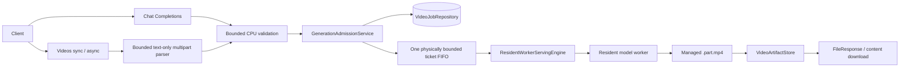
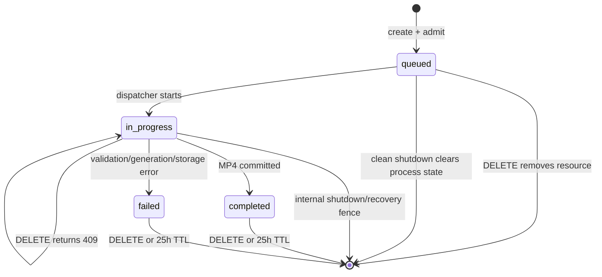

# Videos API Review, Design, and Implementation Record

## Status and authority

This document is the authoritative API direction and local implementation record
for Difflet T2V serving as of 2026-07-16. It supersedes the proposal to expose
video generation through `/v1/chat/completions`. All six dedicated Videos API
routes are implemented; Trainium acceptance is still pending. A later decision
in this record strengthens admission ownership: all generation endpoints that
share one resident engine, including Chat Completions, must use one global FIFO.
The current implementation is shared only within Videos and therefore has a
cross-endpoint admission follow-up before both API families may coexist.

Caller-facing startup, curl, field, response, storage, and error documentation
is maintained separately in [Videos API](../../serving/videos_api.md). This
design record remains authoritative for internal ownership and lifecycle rules.

The accepted Round 1/2 hardening is **implemented locally**: bounded validation
admission, streaming multipart limits, queued-only DELETE, 25-hour expiry, the
4,096-record cap, and storage reservation/sweeper transactions are covered by
CPU/fake-engine tests. Cross-endpoint admission remains separate follow-up work.

The 2026-07-16 implementation decision in
[Residency assumption and investigation register](06_residency_assumption_and_investigation.md)
allows adapters to be written under a provisional one-model residency
assumption. Hardware measurement remains a release gate rather than a coding
prerequisite.

The existing documents remain authoritative for model topology and
resident-worker constraints unless this document explicitly changes a decision.

## Research anchor

- Repository: current repository root
- Remote: `git@github.com:ai-decentralized/Difflet.git`
- Current branch: `feature/serving_t2v`
- Current branch commit: `3cbe695fa4c50ea72c2010e1dd643c980e7a5583`
- `main`, `origin/main`, and `origin/feature/serving_t2v`: `3cbe695`
  (`docs: add difflet serving design (#18)`)
- Research and implementation date: 2026-07-15 through 2026-07-16
- Reference: vLLM-Omni latest Videos API documentation and implementation at
  `238fc0a609311235a671940cf209a7eb72c1dc29` for DELETE/cancellation findings
- Working-tree note: the stale-branch issue was resolved before implementation;
  the local feature working tree now contains the endpoint, service,
process-lifetime state/media ownership, and model-adapter code described here.
The Round 1 design review decisions recorded below supersede current behavior
where they differ: text-only bounded multipart input, tokenizer preload plus a
bounded validation executor, 25-hour terminal retention, and queued-only public
cancellation.

Findings are guaranteed only for the recorded repository state and reference
date.

## Scope

### In scope

- The six vLLM-Omni-style Videos API endpoints.
- Text-only multipart request parsing with explicit body/part/count limits and
  fixed-profile validation.
- Synchronous and asynchronous generation lifecycle.
- Process-local job metadata, queued cancellation, listing, content download, and
  delete.
- File-backed MP4 transport between the resident worker and API process.
- Rollout on `trn2.3xlarge` for Difflet's current T2V models.

### Non-scope for P0

- Multiple resident models sharing the same four logical NeuronCores.
- Dynamic shape compilation or arbitrary resolution/frame-count routing.
- I2V, V2V, S2V, LoRA, frame interpolation, or generated audio.
- Distributed job control across multiple API hosts.
- Claiming that GPU implementations in vLLM-Omni run unchanged on Trainium.

## Observed facts

1. The original T2V design chose `/v1/chat/completions` with a project-defined
   `video_url` content item. That does not implement the requested Videos API.
2. The T2I serving baseline on `main` has one FastAPI parent, one resident model
   worker, bounded admission, request timeout/cancellation, worker recovery, and
   byte-oriented generated output.
3. The initial checkout at `fd724c8` did not contain the tracked
   `difflet/serving/*.py` sources from `main`. After fetching, the remote T2V
   branch was found at `3cbe695`, equal to `main`, and the local branch was
   fast-forwarded to it. The missing sources were a stale-branch issue, not an
   absent merged implementation.
4. vLLM-Omni accepts `multipart/form-data`; its async endpoint stores a job and
   starts generation in the background, while its sync endpoint is stateless and
   returns raw `video/mp4` bytes.
5. vLLM-Omni's reference metadata and task registries are process-local memory.
   Its local storage manager atomically replaces a temporary file, but metadata
   is not durable across a server restart.
6. Difflet shapes are AOT-compiled. Request width, height, and frame count cannot
   be treated as freely dynamic values within one resident serving profile.
7. Existing Trn2 evidence shows that a TP4 resident service consumes all four
   logical NeuronCores. Qwen's validated all-W4 resident profile used about
   68.36 GiB of the 96 GiB HBM target. Flux and Qwen could not remain active on
   the same four cores.
8. vLLM-Omni's public endpoint table describes DELETE as removing a job and
   output. Its current source additionally attempts cancellation for both
   `queued` and `in_progress`; this is current implementation behavior rather
   than a cancellation promise in the public prose.
9. Difflet P0 supports T2V only. Unlike vLLM-Omni's shared T2V/I2V/V2V/S2V
    surface, it accepts no file parts. The reference implementation reads
    uploaded files but does not establish the exact bounded-body contract
    required here.
10. Difflet's README lists Wan 2.2, Wan 2.1, HunyuanVideo 1.0, and LTX-2. The
   real Trn2 benchmark verifies fixed-profile offline generation for LTX-2,
   Wan 2.1, and HunyuanVideo 1.0, but it is not an HTTP Serving or resident
   qualification run. The current Wan 2.2 CLI disables `transformer_2`, so its
   successful benchmark is single-expert only; HunyuanVideo 1.5 is not the
   HunyuanVideo row in that table.

## Implemented decisions

### D1: expose a dedicated Videos API

These endpoints are implemented as first-class FastAPI routes:

| Priority | Method | Path | Lifecycle | Success result |
| --- | --- | --- | --- | --- |
| P0 | `POST` | `/v1/videos` | Process-local async job | `VideoResponse` with `queued` status |
| P0 | `POST` | `/v1/videos/sync` | Stateless synchronous request | streamed `video/mp4` body |
| P0 | `GET` | `/v1/videos/{video_id}` | Job lookup | `VideoResponse` |
| P0 | `GET` | `/v1/videos` | Current-process job listing | cursor-style `VideoListResponse` |
| P0 | `GET` | `/v1/videos/{video_id}/content` | Completed artifact lookup | streamed `video/mp4` body |
| P0 | `DELETE` | `/v1/videos/{video_id}` | Delete queued/terminal; reject running | `VideoDeleteResponse` |

The chat-completions video response may be added later as a thin client-facing
adapter, but it must not own the video job, storage, or generation lifecycle.
It also must not invoke the resident engine directly; it enters the same global
generation admission service as every Videos create request.

### D2: one server process serves one model and one compiled profile

The request `model` field may be omitted or must equal the server model. The
resolved request shape must equal the immutable serving profile:

- `size` must agree with `width` and `height` when both forms are supplied.
- Final width and height must equal the compiled profile.
- `seconds * fps`, when used to derive frame count, must equal the compiled
  `num_frames`.
- `num_frames`, when supplied directly, must equal the compiled profile.
- `fps` is an encode/output contract only when the model adapter confirms that
  it does not alter a compiled model input.

A future profile router can select among multiple precompiled buckets. Dynamic
compilation is not part of request handling.

### D3: file-backed output is a P0 requirement

Normal video requests do not send an MP4 byte array through the multiprocessing
connection. The implemented ownership protocol is:

1. The parent allocates a confined request staging path.
2. The worker generates and encodes to a parent-created
   `<video_id>.<token>.part.mp4` file.
3. The worker returns a small file-backed result containing path, media type,
   size, and media metadata.
4. The parent validates the result and atomically publishes the final file.
5. Async jobs retain the file until DELETE, terminal TTL expiry, or
   serve-process shutdown. Sync requests stream the file and delete it after the
   response finishes. If the sync client disconnects after dispatch, the healthy
   generation continues and its output is discarded/cleaned at completion.
6. Clean shutdown purges staging and final files. After a crash, the next
   same-profile process to acquire the media-root lease purges residual managed
   files before accepting requests; worker recovery also sweeps abandoned
   `.part` files when safe.

The path must be confined to a server-owned root and must never come from a
client-controlled filename.

### D4: keep job metadata and video blobs behind separate interfaces

Do not force the current image-oriented `put_bytes/get_url` store to implement
job semantics. Add two boundaries:

```text
VideoJobRepository
  create / get / update / list / delete / clear

VideoArtifactStore
  allocate_staging / commit / open / delete / purge_all
```

Implemented P0 storage:

- `InMemoryVideoJobRepository` for process-local job metadata and
  transition-checked compare-and-swap.
- A local filesystem root for MP4 files.
- OS file locking/root lease and atomic rename for publication. The lease is
  scoped to one profile's media root; a second owner fails startup.
- A later S3/R2 backend may implement `open` as proxy streaming or a controlled
  redirect, but it is not required for the first endpoint-complete milestone.

This intentionally follows the reference implementation's process-local job
lifetime. Restarting the serve process discards all jobs: old IDs return `404`
and `GET /v1/videos` starts empty. The file store remains useful for atomic
publication during the process lifetime, but it is not a persistence boundary.

Terminal jobs expire 25 hours after entering `completed` or `failed`. A
periodic sweeper, initially every five minutes, removes their metadata and
media. Disk-pressure thresholds emit structured warning/error logs. Before
admission, storage must reserve the profile's maximum artifact size plus a
safety margin; inability to do so returns `507 video_storage_full`. The
effective retention is therefore the minimum of process lifetime and 25 hours.
Queued/in-progress jobs expose `expires_at: null`; the terminal CAS writes the
actual value. Async admission reserves one of 4,096 configurable job-record
slots before creation; queued/terminal DELETE, TTL, and shutdown release it.
Exhaustion after an opportunistic sweep returns `429 video_retention_full`.

One process-wide ledger reserves `max_artifact_bytes` for every active sync or
async request plus one global `max(1 GiB, max_artifact_bytes)` safety margin.
Commit converts the active maximum to actual bytes; failure/queued DELETE,
terminal DELETE/TTL, sync cleanup, and shutdown release accounting at their
respective fenced cleanup points. Artifact publication, terminal deletion,
content-lease acquisition, and sweeping share an artifact-lifecycle lock.
Deletion is artifact-first/metadata-second; unlink failure retains the job,
bytes, and slot for retry.

### D5: one global bounded admission service per resident engine

The FastAPI lifespan must create one `GenerationAdmissionService` for the serve
process/resident engine. Every route that can trigger generation fans into it:
at minimum Chat Completions, Videos async, and Videos sync. Read-only routes do
not consume its slots, and DELETE enters its queued-deletion control plane rather
than waiting behind generation work.

- Async Video: reserve a global ticket, record `queued` in memory without
  changing ticket order, enqueue atomically, and return immediately.
- Sync Video: reserve/enqueue an ephemeral ticket, await it, stream its temporary
  output, and create no job record.
- Chat Completions: reserve/enqueue through the same service; the handler may
  not call `engine.generate` directly.

Capacity includes reserved/creating, queued, and running work across endpoint
types. Ticket assignment after cheap validation is the FIFO linearization point.
The physical queue must also be bounded: cancelled entries are removed or
compacted, or retain their capacity slot until dequeued. Only one dispatcher
calls the resident engine, whose independent waiting queue is disabled.

Current gap: `VideoGenerationService` implements the Video sync/async subset,
while Chat calls the engine directly. Modality-gated route registration prevents
the two paths from coexisting today, but the global service above is mandatory
before that gating is relaxed.

"Cheap validation" includes bounded body parsing and tokenization. Every image
and video tokenizer is loaded on CPU during startup before readiness; these are
vocabulary/rules assets, not model weights and not Neuron/HBM residents.
Per-request tokenization and model validation run on a bounded CPU executor.
Only a valid request may receive a generation ticket, so invalid traffic cannot
block the event loop or consume FIFO capacity.
P0 defaults to four synchronous CPU validation workers plus 32 physically
waiting entries and a 30-second validation timeout; generation still permits
only one running request. Each validator call is synchronous in an executor
thread and asynchronously awaited by FastAPI. A full validation domain returns immediate
`429 validation_capacity_exhausted`; timeout returns
`504 validation_timeout`. The total request deadline starts when validation
capacity is requested and includes validation, generation queueing, and model
execution. The backing executor submission queue itself must be bounded.
Started validation owns its running slot until the future really finishes even
after timeout/disconnect; unstarted work releases a waiting slot only after
successful atomic removal, otherwise it retains capacity until completion.
These are four threads in one dedicated FastAPI-lifespan executor, not Uvicorn
processes or resident model workers.

Dispatcher and queued DELETE share the admission-state lock. Under it,
dispatcher atomically dequeues, claims, and performs `queued -> in_progress`;
DELETE either removes/releases the queued entry first or sees the claim and
returns `409 video_in_progress`. Sync disconnect uses the same claim boundary.

## Target architecture



### Async lifecycle



Allowed transitions must be enforced in the repository rather than by arbitrary
field updates. Artifact publication precedes the terminal `completed` commit, so
the content endpoint never observes a completed job without a committed file.

## Request contract

Both create endpoints accept `multipart/form-data`, but P0 is text-to-video
only. Enforce these limits while reading the request, including chunked bodies:

- zero file parts;
- at most 32 form fields;
- at most 256 KiB per text part;
- at most 1 MiB for the complete request body.

A file field returns stable `feature_not_supported`; a size/count overflow
returns `413 request_too_large`. Do not first materialize an unbounded
`request.form()` and reject it afterward.

### P0 fields

| Field | Rule |
| --- | --- |
| `prompt` | Required, non-empty, bounded before tokenization |
| `model` | Optional; must match the server model |
| `seconds` | Optional positive integer string; reconciled with `fps/num_frames` |
| `size` | Optional `WIDTHxHEIGHT`; reconciled with explicit dimensions |
| `width`, `height`, `num_frames` | Optional but must resolve to the compiled profile |
| `fps` | Positive integer and model-capability checked |
| `num_inference_steps` | Bounded per model |
| `guidance_scale` | Finite and model-capability checked |
| `guidance_scale_2` | Wan 2.2 only after its two-transformer path is correct |
| `boundary_ratio` | Wan 2.2 only after its two-transformer path is correct |
| `flow_shift` | Only when the adapter exposes it as request-safe |
| `negative_prompt` | LTX-2/Wan adapters only after validator coverage |
| `seed` | Bounded integer |
| `user` | Optional opaque metadata; never used as a path or logged verbatim |

### Explicit P0 rejections

Reject `input_reference`, `image_reference`, `video_reference`,
`audio_reference`, `generate_sound`, frame interpolation, LoRA, and arbitrary
`extra_params` with a stable `feature_not_supported` error until their input
validation, SSRF limits, upload limits, and model behavior are implemented.

## Response and error behavior

### Async create

Return a job object with at least:

```json
{
  "id": "video_gen_<uuid>",
  "object": "video",
  "status": "queued",
  "model": "Lightricks/LTX-2",
  "prompt": "A paper boat on a rainy street",
  "created_at": 1784131200,
  "expires_at": null
}
```

### Sync result

- Body: raw/streamed MP4 content.
- `Content-Type: video/mp4`.
- Headers: `X-Request-Id`, `X-Model`, `X-Inference-Time-S`.
- No job record or retained final artifact.

### Common status mapping

| Condition | HTTP status |
| --- | ---: |
| Invalid form or conflicting shape fields | 400 |
| Unsupported feature/model parameter | 400 |
| Body, part, or field-count limit exceeded | 413 |
| Queue full / admission rejected | 429 |
| Validation domain full | 429 (`validation_capacity_exhausted`) |
| Async job-record cap reached | 429 (`video_retention_full`) |
| Unknown job | 404 |
| Content requested before completion | 409 |
| DELETE after dispatcher started | 409 (`video_in_progress`) |
| Failed job content requested | 422 |
| Request/generation deadline exceeded | 504 |
| Validation sub-deadline exceeded | 504 (`validation_timeout`) |
| Worker unavailable/recovering | 503 |
| Artifact safety reserve unavailable | 507 (`video_storage_full`) |
| Generation, encoding, or storage failure | 500/502 as appropriate |

Failed job metadata remains retrievable until its 25-hour terminal TTL or the
end of the serve-process lifetime and contains a stable structured error.
`DELETE` removes both metadata and any committed/partial artifact.

The vLLM-Omni reference source at
[`238fc0a`](https://github.com/vllm-project/vllm-omni/blob/238fc0a609311235a671940cf209a7eb72c1dc29/vllm_omni/entrypoints/openai/api_server.py#L3223-L3272)
cancels both `queued` and `in_progress` background tasks, waits up to two
seconds, and returns `409` if cancellation is still in progress. Cancellation
propagates to an
[internal engine abort](https://github.com/vllm-project/vllm-omni/blob/238fc0a609311235a671940cf209a7eb72c1dc29/vllm_omni/entrypoints/async_omni.py#L438-L449),
but a non-preemptible model execution may continue until its current call
returns. Difflet intentionally adopts a narrower contract: DELETE guarantees
queued work never starts, but returns `409 video_in_progress` once the dispatcher
has taken the ticket. Public DELETE sends no cancellation signal to healthy
running work. Hard deadlines, clean shutdown, and worker failure may still use
terminate/restart fencing as internal recovery; they are not user cancellation.

## Model and Trn2 residency assessment

`trn2.3xlarge` should be operated as one model server per instance/core
partition. "All stages of one model remain resident" and "all models remain
resident simultaneously" are separate questions; the latter is not viable on
the four-core target.

For implementation, each eligible profile is provisionally treated as able to
remain resident in its own serve process. The checked-in offline benchmark is
real Trn2 execution evidence, but not resident proof: it reloads weights in a
new CLI process per sample and records no T2V peak HBM or RSS/PSS. AWS
documents 128 GB host memory and 96 GB accelerator HBM for `trn2.3xlarge`, while
the prior Linux observation is approximately 124 GB host memory. Explicit host
stages reduce particular Neuron loads but do not provide generic CPU offload.

| Model | Offline evidence | Resident conclusion | Serving priority |
| --- | --- | --- | ---: |
| LTX-2 | Real Trn2 TP4 480x704x49 generation; finite tensor | Provisional hybrid adapter; only DiT is on Neuron; target RSS/HBM measurement pending | 1 |
| Wan 2.1 14B | Real Trn2 TP4 480x832x9 generation; finite tensor | Provisional W4 prompt/DiT with explicit host VAE; resident reuse measurement pending | 2 |
| Wan 2.2 A14B | Real Trn2 single-transformer path; current CLI disables `transformer_2` | Full semantics and resident memory not qualified for serving | 4 |
| HunyuanVideo 1.0 | Real Trn2 TP4 320x512x61 staged generation; finite tensor | Provisional host CLIP/VAE plus W4 Llama/DiT adapter; full co-load/reference test pending | 3 |
| HunyuanVideo 1.5 | Download/scaffold only | Not eligible until offline compile and generation work | 5 |
| Wan 2.1 1.3B | Present in the reference project's model list, not Difflet's current allowlist | Not ported or validated | Future research |

For each resident profile, require one immutable process world, compatible
component rank meshes, successful co-load/warmup/generation/shutdown, and
measured memory headroom. Equal TP is not required when components share a
valid world/rank layout; equal or compatible process-world assumptions are.

## Implementation record and remaining rollout

### Phase 0: restore a valid serving baseline — complete

1. Resolve the current `tasks/todo.md` unmerged state without discarding either
   side.
2. Integrate the `main` serving implementation into `feature/serving_t2v`.
3. Preserve the newer T2V/model/DP work on the feature branch.
4. Restore the `serve` optional dependency group and add `python-multipart`.
5. Run the existing T2I serving and relevant CLI tests before T2V changes.

Implementation began only after the local branch, `main`, and both relevant
remote refs were confirmed at the same baseline commit.

### Phase 1: protocol, capability, and storage contracts — complete

Added:

```text
difflet/serving/openai/protocol/videos.py
difflet/serving/openai/serving_video.py
difflet/serving/video_jobs.py
difflet/serving/video_storage.py
```

This phase includes request/response models, model capabilities, fixed-profile
normalization, a transition-checked in-memory job repository, confined atomic
local artifacts, and the exclusive media-root lease.

### Phase 2: shared scheduling and file-backed engine output — local milestone complete

1. Add the lifespan-owned, live-capacity-bounded `VideoGenerationService` for
   the Videos-only milestone.
2. Route sync and async requests through one admission domain.
3. Extend the worker output contract with a file-backed variant.
4. Keep stage-boundary checks for internal deadline/shutdown/worker-failure
   recovery; public running DELETE does not invoke them.
5. Reuse the existing worker restart path when a request deadline or worker
   failure cannot safely recover the worker.
6. On clean shutdown, clear jobs and purge all managed MP4 files; on startup,
   acquire the media-root lease and purge crash residue before admission.

This completion applies to Videos sync/async only. Phase 2b local hardening is
also complete: running DELETE is narrowed, tokenizers preload, validation/body
parsing is bounded, terminal TTL and disk-pressure protection are active, and
dispatch/delete share one linearization point. The remaining Phase 2b work is
generalizing admission across Chat Completions and every other generation route
before those route families may coexist; its tests must cover mixed-route
ticket order and shared capacity.

### Phase 3: all six routes with a fake worker — complete

Implement every endpoint and cover:

- success and validation errors;
- async state transitions and failed-job retrieval;
- sync statelessness;
- list ordering/cursors/limits;
- content gating and download headers;
- queued deletion, in-progress `409`, and completion-vs-terminal-delete races;
- queue full, timeout, shutdown, worker restart, process-restart reset, and
  crash-residue cleanup.

Endpoint completeness is first proven with the fake worker so hardware failures
cannot hide API/state defects.

### Phase 4: LTX-2 endpoint-complete MVP — locally implemented, hardware gate pending

1. Use the implemented one-stage opaque LTX-2 resident adapter.
2. Start with TP4, CP1, CFG-parallel disabled, one fixed profile, silent MP4.
3. Keep host text/connector/decode components and measure host RAM as well as HBM.
4. Run all six endpoint flows on `trn2.3xlarge`, including queued deletion,
   in-progress rejection, and a second request after internal recovery.
5. Promote the provisional allowlist entry to supported only after the hardware
   gate passes.

### Phase 5: Wan 2.1 — locally implemented, hardware gate pending

1. Use the implemented resident W4 prompt encoder and DiT generation.
2. Decode/export with the host VAE; do not co-load the current W1 Neuron VAE.
3. Support negative prompt and applicable guidance fields through a
   model-specific validator.
4. Repeat the complete API, media, memory, queued-deletion, TTL, storage-pressure,
   and recovery suite.

### Phase 6: remaining model gates

- Wan 2.2: enable and validate `transformer_2`, verify the scheduler boundary,
  then measure both DiTs co-resident before exposing HTTP serving.
- HunyuanVideo 1.0: use the implemented host CLIP/VAE plus W4 Llama/DiT adapter,
  then run a full co-load/reference experiment before support is claimed.
- HunyuanVideo 1.5: finish the offline compile/generate path first.

If a correct model does not fit as one resident set, use an explicit staged or
rotating executor. Do not hide component unload/reload behind the current
in-process stage abstraction.

## Verification and release gates

### Local/CPU gate

- Protocol, validation, state-machine, repository, and storage tests.
- All six endpoint integration tests with a fake engine.
- Existing image serving behavior remains unchanged.
- Static import/compile checks, formatter, type checks, and `git diff --check`.

### Trainium gate per model/profile

1. Resolve and validate every compiled artifact.
2. Start on the intended visible core set and prove readiness with real inference.
3. Record HBM and host RAM after load, warmup, and peak generation.
4. Generate a fixed-seed MP4 and validate codec, dimensions, frame count, fps,
   and duration with PyAV/ffprobe.
5. Exercise async create/poll/content/delete and synchronous generation.
6. Exercise queued deletion, in-progress `409`, request timeout, worker recovery,
   and a successful second request.
7. Verify 25-hour expiry with an accelerated clock, the periodic sweeper,
   warning/error disk logs, and hard reserve rejection.
8. Shut down cleanly and verify no in-memory jobs, `.part` files, or final MP4
   files remain; restart and verify old IDs return `404` and list is empty.

Recommended admission target: peak HBM at or below approximately 85% and host
RAM below 80% without swap. A model that fails correctness, co-residency, or
recovery is not added to the public serving allowlist.

## Remaining deployment decisions

1. **Lifecycle boundary:** local jobs exist only for the current serve process.
   Clean shutdown clears jobs and media; process restart does not restore IDs.
2. **Remote artifacts:** decide whether a future S3/R2 content route proxies
   bytes or returns a controlled redirect. P0 intentionally uses local storage.
3. **Capacity targets:** the approximate 85% HBM and 80% host-RAM thresholds are
   provisional until the real per-profile runs establish stable headroom.
4. **Production support:** do not label any T2V profile supported until its
   artifact identity, first/second inference, timeout recovery, long-run reuse,
   media correctness, RSS/PSS, and HBM record is attached.
5. **Global admission:** do not co-register Chat Completions and Videos against
   one resident engine until both are routed through the same lifespan-owned
   ticket FIFO and capacity/recovery domain.
6. **Retention and pressure:** retain terminal jobs for at most 25 hours within
   one process, sweep periodically, log disk pressure, and preserve a hard
   artifact safety reserve.

## Reference source map

- vLLM-Omni Videos API documentation:
  <https://docs.vllm.ai/projects/vllm-omni/en/latest/serving/videos_api/>
- Reference protocol:
  <https://github.com/vllm-project/vllm-omni/blob/main/vllm_omni/entrypoints/openai/protocol/videos.py>
- Reference routes and job lifecycle:
  <https://github.com/vllm-project/vllm-omni/blob/main/vllm_omni/entrypoints/openai/api_server.py>
- Reference in-memory stores:
  <https://github.com/vllm-project/vllm-omni/blob/main/vllm_omni/entrypoints/openai/stores.py>
- Reference local artifact storage:
  <https://github.com/vllm-project/vllm-omni/blob/main/vllm_omni/entrypoints/openai/storage.py>
- Difflet model rollout evidence: `README.md`, `difflet/cli/orchestrators/`, and
  `docs/design/qwen_trn2_topology/` on `main`.
