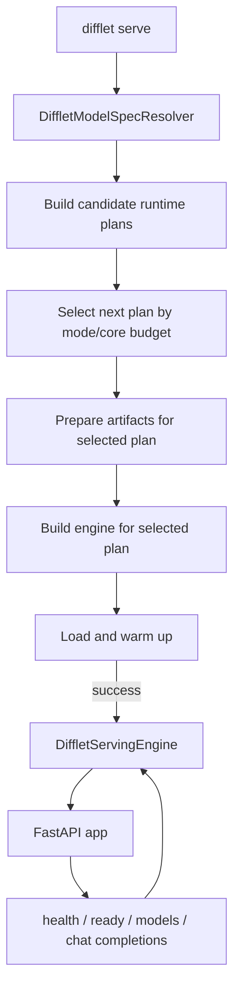
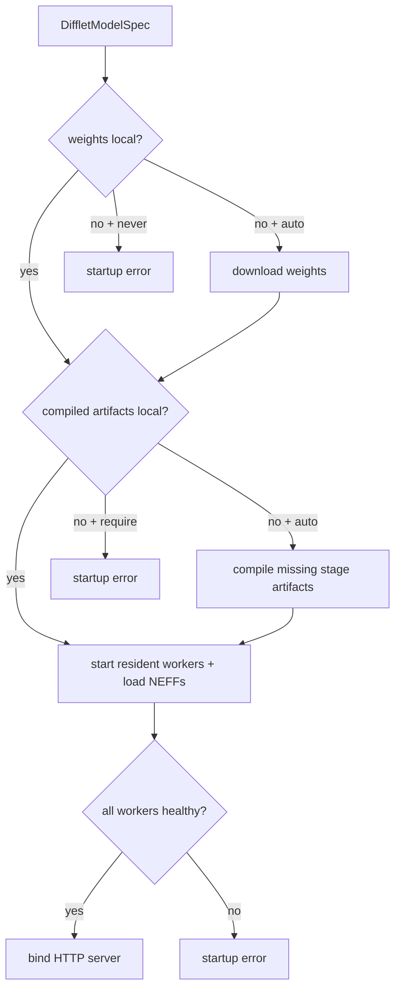

# Difflet Serving Engine Plan

Date: 2026-07-06

Reference: `/Users/clark/project/vllm-omni/docs/design/difflet_serving` plus
direct source inspection under `/Users/clark/project/vllm-omni/vllm_omni`.

API contract: [Difflet Chat Completions Contract](../design/difflet_serving/chat_completions_contract.md).

Architecture: [Difflet Serving Architecture](../design/difflet_serving/architecture.md).

Engine design: [Difflet Serving Engine](../design/difflet_serving/engine.md).

## Goal

Add a FastAPI serving layer for Difflet that exposes OpenAI-style
`/v1/chat/completions` for text-to-image generation, without binding the HTTP
API or serving engine to a fixed model or fixed number of stages.

Use `/v1/chat/completions` as the first public API, not
`/v1/images/generations`. The images endpoint is more semantically direct, but
it does not cover Difflet's model-specific generation and shape parameters
cleanly. The chat route acts as a compatibility wrapper: it extracts a prompt
from `messages`, reads Difflet-specific generation knobs from `extra_body`,
calls the generic serving engine, and returns an image content item.

The first target request shape is:

```bash
curl -s http://localhost:8091/v1/chat/completions \
  -H "Content-Type: application/json" \
  -d '{
    "messages": [
      {"role": "user", "content": "A beautiful landscape painting"}
    ],
    "extra_body": {
      "height": 1024,
      "width": 1024,
      "num_inference_steps": 50,
      "guidance_scale": 4.0,
      "seed": 42
    }
  }'
```

The MVP deployment response should return an R2-backed URL in
`choices[0].message.content[0].image_url.url`.

## MVP Decisions

Current MVP target, as of 2026-07-09:

- Hardware budget: assume one 4-NeuronCore serving allocation.
- Workload: text-to-image only.
- Models: MVP serves explicitly registered Qwen-Image and Flux text-to-image
  adapters. Each server process still loads exactly one model/profile and
  exposes exactly one output modality.
- Parallel defaults come from `difflet.registry` unless the `difflet serve`
  startup flags override them. Qwen's registry profile is `tp_degree=4`,
  `cp_degree=1`; Flux should default to the registry value (`tp_degree=8`
  today) unless the operator starts serving with an explicit supported override
  such as `--tp-degree 4 --cp-degree 1`.
  On a 4-core serving allocation, a Flux server that omits `--tp-degree` will
  fail core-budget admission unless the registry default changes or the adapter
  provides a verified 4-core serving default. Do not silently rewrite model
  defaults during startup.
- Disabled runtime features:
  - CFG-parallel disabled. Treat Qwen and Flux as not supporting CFG-parallel
    in MVP.
  - TeaCache disabled by default until Bin confirms the serving-safe settings.
  - Sequence parallelism (`--sp`) is disabled in MVP serving, even for models
    where the CLI supports it. Reject it at serving startup until the resident
    worker path is verified for that profile.
- AOT compile is required. Without compiled artifacts, serving may be roughly
  10x slower or may be unable to load the intended Trainium path. Startup must
  verify compiled artifacts before reporting ready.
- Core/HBM model: use a shared-process runtime plan by default. One worker
  process reserves the 4-core group and runs the image stages sequentially
  inside that process.
  NeuronCore placement is process-owned: a single NeuronCore is allocated to a
  single process, and processes do not share NeuronCores. Within that process,
  Neuron supports loading more than one model in the same NeuronCore group; the
  runtime switches between loaded models as the application invokes them.
- Stage data passing:
  - Shared-process path should first try in-memory Python/tensor references
    between stages.
  - If a future multi-process implementation is added, it must use
    request-scoped local files under `work_dir/{request_id}/...`.
- Concurrency: `max_running_requests=1` for image and video generation. Do not
  raise this until a resource scheduler is implemented.
- Output artifacts: the engine returns final image bytes. The OpenAI serving
  handler writes those bytes through `ArtifactStore`, with R2 as the P0 backend,
  and returns an `image_url.url` that points to the stored artifact or presigned
  URL. Local file serving and data URLs are not part of P0.
- R2 credentials are provided through environment variables at server startup.
- Multiple AOT profile combinations may be precompiled and stored on disk, but
  P0 loads exactly one active `ServingProfile`. Multi-profile loading/warmup is
  future-only.
- Runtime mode: MVP uses one FastAPI process and one Trainium worker process
  for the active model/profile. That worker reserves the 4-core group, loads the
  required model/stage applications if possible, and serializes generation.
  Rotating resident remains a future extension point, not an MVP fallback path.
  Subprocess execution remains an offline CLI/debug concept, not a P0 serving
  runtime plan.

Open validation items:

- Bin to confirm exact AOT compile behavior and serving-safe TeaCache defaults.
- Serving implementation must validate the concrete Qwen shared-process
  topology and the Flux worker-owned pipeline path with full load plus smoke
  requests on the target Trainium environment. Neuron placement allows multiple
  loaded models in one process,
  but readiness still depends on the actual Qwen artifacts, HBM use, and
  adapter compatibility.

## What vLLM-Omni Does

vLLM-Omni does not hard-code a model's stage count in the HTTP route.
It uses a three-layer separation:

1. Pipeline topology declaration.
2. Stage config resolution/factory.
3. Engine runtime construction from resolved stage configs.

Important source anchors:

- `vllm_omni/config/stage_config.py`
  - `StagePipelineConfig` declares immutable stage topology: `stage_id`,
    `model_stage`, `execution_type`, `input_sources`, `final_output`,
    `final_output_type`, model subdirs, and custom hooks.
  - `PipelineConfig` groups a model's stages and supports validation.
- `vllm_omni/config/pipeline_registry.py`
  - `OMNI_PIPELINES` maps `model_type` to either a `PipelineConfig` or a
    resolver callable.
  - Single-stage diffusion models are intentionally not all registered there;
    they can fall back to a default single-stage diffusion config.
- `vllm_omni/config/config_factory.py`
  - `StageConfigFactory.create_from_model()` resolves model type from HF config,
    explicit deploy config, architecture fallback, diffusers `model_index.json`,
    or name fallback.
  - `_create_from_registry()` merges topology with deploy/runtime overrides.
  - `create_default_diffusion()` builds a single diffusion stage when no
    multi-stage pipeline registry entry applies.
- `vllm_omni/entrypoints/omni_base.py`
  - `OmniBase` constructs `AsyncOmniEngine`, then derives default
    `output_modalities` from per-stage metadata.
- `vllm_omni/engine/async_omni_engine.py`
  - `AsyncOmniEngine` resolves stage configs, builds runtime stage pools/clients,
    stores stage metadata, and owns lifecycle/health.
- `vllm_omni/entrypoints/openai/serving_chat.py`
  - `/v1/chat/completions` parses chat messages and `extra_body`.
  - When the requested/default modality includes `image`, it extracts a clean
    prompt, applies image generation fields to diffusion-stage sampling params,
    calls `engine_client.generate(...)`, and formats images as
    `data:image/png;base64,...`.

The transferable pattern is: route -> generic serving handler -> engine
interface -> resolved model topology -> stage runtime.

### vLLM-Omni Process And IPC Model

vLLM-Omni is multi-process for resident multi-stage serving. The HTTP/OpenAI
entrypoint does not run model forward directly. It submits work to
`AsyncOmniEngine`, which starts an orchestrator thread and initializes stage
runtimes/stage pools at server startup.

Important source anchors:

- `vllm_omni/engine/async_omni_engine.py`
  - `AsyncOmniEngine.__init__()` creates janus request/output/RPC queues.
  - It starts `orchestrator_thread`, then waits for stage initialization.
  - `_initialize_stages()` calls `create_stage_runtime(...).initialize()`.
- `vllm_omni/engine/stage_runtime.py`
  - `StageRuntime` is the single-node stage runtime.
  - It launches stage processes directly and creates static `StagePool`
    instances.
  - `_initialize_local_diffusion_replica()` initializes or launches a diffusion
    stage replica during startup.
- `vllm_omni/engine/stage_engine_startup.py`
  - `launch_stage_replica()` starts local LLM engine-core processes and wires
    ZMQ addresses/handshake.
  - `launch_diffusion_stage_replica()` either initializes inline single-stage
    diffusion or starts a `StageDiffusionProc` subprocess for distributed/local
    stage serving.
- `vllm_omni/engine/stage_pool.py`
  - `StagePool` owns one logical stage's replica clients.
  - `select_replica_id()` binds a request to a live replica, round-robin when
    multiple local replicas exist.
  - `submit_initial()` submits a request to the chosen stage client.
- `vllm_omni/diffusion/stage_diffusion_client.py`
  - `StageDiffusionClient` communicates with `StageDiffusionProc` via ZMQ
    PUSH/PULL sockets.
  - `add_request_async()` serializes an `add_request` message and sends it to
    the diffusion subprocess.

The request path is:

```text
FastAPI/OpenAI handler
  -> AsyncOmniEngine request queue
  -> Orchestrator thread
  -> StagePool.select_replica_id(...)
  -> StagePool.submit_initial(...)
  -> Stage client
  -> worker / engine-core / diffusion subprocess
  -> stage output back to orchestrator
  -> next stage or final OpenAI response
```

vLLM-Omni controls resource pressure by configuration and placement rather than
by unloading stages between requests:

- `OmniStageRuntimeConfig.devices` places a stage on specific devices.
- `OmniStageRuntimeConfig.num_replicas` controls how many resident copies of a
  stage are created.
- `StagePool` routes requests across live replicas.
- If a stage cannot start or load on its assigned resources, startup fails.

Difflet should copy this lifecycle shape, but replace GPU/device placement with
Trainium-aware core/HBM planning and per-stage Neuron runtime env.

## Difflet Adaptation

Difflet should use the same separation, but with smaller Trainium-specific
types.

Do not make `DiffletServingEngine` know that Qwen-Image has exactly three
stages or Flux has exactly one stage. Instead, let a resolver produce a
`DiffletModelSpec`, and let an engine factory choose the correct runtime
strategy from that spec.

## Existing Difflet Capabilities To Reuse

Difflet already has the download, AOT compile, cache, and generate lifecycle in
the CLI and Python pipeline. Serving should reuse those pieces rather than
creating a second artifact system.

Current public flow from README:

```bash
difflet run --model-id black-forest-labs/FLUX.1-dev \
  --tp-degree 2 --cp-degree 2 \
  --height 1024 --width 1024 \
  --prompt "a photorealistic cat sitting in a sunlit garden" \
  --output cat.png
```

This means the server startup lifecycle should adapt existing primitives:

- Download: reuse `difflet.pipeline.path_resolver.resolve_model_path(...)` and
  the existing `difflet download` behavior.
- Single-process compile/load: reuse `DiffletPipeline.precompile(...)` and
  `DiffletPipeline.from_pretrained(..., skip_compile=True)`.
- Pipeline load: reuse `DiffletPipeline.load(...)`, which delegates to the
  existing backend-aware `_load_app(...)` helper and model application
  `app.load(...)`.
- Compile cache key/manifest: reuse `difflet.pipeline.compile_cache.CacheSpec`,
  `cache_path(...)`, `has_valid_manifest(...)`, and `write_manifest(...)` where
  the model can use `DiffletPipeline`.
- Staged models: reuse the current orchestrator stage compile/load logic as the
  source of truth, but extract it behind serving stage adapters instead of
  calling CLI methods from HTTP handlers.
- Existing model metadata: reuse `difflet.registry.resolve_model(...)` for
  default shape, default parallel config, backend support, and download
  patterns.

Serving should add orchestration around these primitives:

- policy decisions: whether startup may download or compile.
- topology resolution: which stages exist for a model.
- resident worker lifecycle: start, load, health, request execution, shutdown.
- OpenAI response formatting.

## Proposed Abstractions

### Stage Role Vs Runtime Kind

Separate what a stage does from how it runs.

`stage_role` is the model-independent semantic role:

```python
class DiffletStageRole(str, Enum):
    PROMPT_ENCODER = "prompt_encoder"
    CONDITION_ENCODER = "condition_encoder"
    DENOISER = "denoiser"
    DECODER = "decoder"
    PIPELINE = "pipeline"
```

`kind` is the runtime execution mechanism:

```python
class DiffletStageKind(str, Enum):
    RESIDENT_WORKER = "resident_worker"  # loaded inside a long-lived worker process
    ROTATING_RESIDENT = "rotating_resident"  # host-resident, attach/load to cores on demand
```

For the serving implementation, `RESIDENT_WORKER` is the primary P0 target for
both single-pipeline and multi-stage Trainium models. Flux is represented as
one `PIPELINE` role stage with `kind=RESIDENT_WORKER`; Qwen is represented as
three worker-owned stages. A subprocess debug harness can be designed later, but
it is not a P0 runtime kind.

`ROTATING_RESIDENT` is a future middle ground for smaller Trainium allocations. Its
intended semantics are:

- Keep model-side Python state, tokenizer/config, and host-memory weights warm
  when practical.
- Attach/load the compiled Neuron artifact onto Trainium cores only when that
  stage is scheduled.
- Detach/unload before another rotating stage needs the same core budget.
- Preserve per-request stage ordering, but pay attach/load overhead for rotated
  stages.

This is not as fast as full resident serving. It should remain in the design as
an extension point, but P0 should not depend on it because current load
primitives do not yet provide a proven unload/detach path for releasing device
state/HBM inside a long-lived process.

This means `resident_worker.py` is a runtime strategy for the resolved model
topology, not a model abstraction. It starts a long-lived worker process and
keeps the active profile's NEFF/runtime state loaded, which is the serving
performance target for Trainium.

### Stage Spec

```python
@dataclass(frozen=True)
class DiffletStageSpec:
    stage_id: int
    name: str
    role: DiffletStageRole
    kind: DiffletStageKind
    input_sources: tuple[int, ...] = ()
    output_artifacts: tuple[str, ...] = ()
    final_output: bool = False
    final_output_type: str = "image"
    num_cores: int | str = "auto"
    num_replicas: int = 1
    virtual_core_size: int | None = None
    estimated_hbm_bytes: int | None = None
    compiled_dir_template: str | None = None
    runner: str | None = None
```

Notes:

- `input_sources` makes stage topology explicit and general.
- `role` lets HTTP handlers reason about the pipeline without knowing model
  names like `qwen text`, `wan transformer`, or `hunyuan llama`.
- `runner` can be a dotted import path or registry key, such as
  `difflet.serving.stages.qwen_image:run_text_stage`.
- `compiled_dir_template` keeps cache layout declarative.
- `num_cores` and `virtual_core_size` are required because Trainium runtime
  placement is stage-specific.
- `num_replicas` controls how many workers exist for the same logical stage.
  P0 should keep this at `1`.
- `estimated_hbm_bytes` is optional and advisory. It can help print useful
  startup plans, but actual HBM/runtime feasibility is determined by loading
  and warming the worker.

Generic role mapping examples:

| Model-specific stage | Generic role |
| --- | --- |
| Qwen-Image `text` | `PROMPT_ENCODER` |
| Qwen-Image `generate` | `DENOISER` |
| Qwen-Image `vae` | `DECODER` |
| Wan `transformer` | `DENOISER` |
| Wan `vae` | `DECODER` |
| HunyuanVideo `clip` | `CONDITION_ENCODER` |
| HunyuanVideo `llama` | `PROMPT_ENCODER` |
| HunyuanVideo `generate` | `DENOISER` plus `DECODER` in one stage |
| Flux single `DiffletPipeline` | `PIPELINE` |

### Model Spec

```python
@dataclass(frozen=True)
class DiffletModelSpec:
    model_type: str
    base_entry: ModelEntry
    input_modalities: tuple[str, ...]
    output_modalities: tuple[str, ...]
    default_shape: dict[str, int | None]  # copied from base_entry/default overrides
    default_parallel: DiffletParallelConfig  # copied from base_entry/default overrides
    stages: tuple[DiffletStageSpec, ...]
    runtime_plans: tuple["DiffletRuntimePlan", ...] = ()
```

This is Difflet's equivalent of vLLM-Omni `PipelineConfig`, but with Trainium
runtime fields instead of vLLM scheduler/worker fields.

`base_entry` is the existing `difflet.registry.ModelEntry` returned by
`resolve_model(...)`. Serving should not maintain a second list of model ids,
download patterns, or base defaults.

For MVP compatibility, `stages` can represent the default/full-resident plan.
When `runtime_plans` is present, the engine must use the selected
`DiffletRuntimePlan.stages`, not mutate `model_spec.stages`.

### Runtime Plan Selection

MVP should not dynamically rewrite `DiffletStageSpec.kind` inside the engine
factory. Keep the rule simple:

- `DiffletStageSpec.kind` is plan-specific and immutable.
- The serving registry may register multiple runtime plans for the same model.
- `--engine-mode auto` selects one registered plan. It does not invent a new
  plan by changing stage kinds at runtime.

```python
@dataclass(frozen=True)
class DiffletRuntimePlan:
    plan_id: str
    engine_mode: str  # resident for P0; rotating_resident is future-only
    core_allocation: str  # per_stage_process or shared_process
    stages: tuple[DiffletStageSpec, ...]
    worker_count: int = 1
    required_cores: int | str = "auto"
    peak_cores: int | str = "auto"
    estimated_resident_hbm_bytes: int | None = None
    estimated_peak_hbm_bytes: int | None = None
```

For P0, keep this deliberately small:

- Default to a Qwen shared-process plan for the 4-core target:
  `prompt_encoder=RESIDENT_WORKER`, `denoiser=RESIDENT_WORKER`,
  `decoder=RESIDENT_WORKER`, `core_allocation=shared_process`, with stage
  execution serialized inside one worker process.
- If shared-process load/warmup fails because the stage artifacts cannot
  coexist in one Neuron runtime process, fail startup. Do not silently switch
  to subprocess or rotating resident in MVP.
- Keep rotating resident plans out of the P0 automatic selection path until an
  adapter declares `supports_unload=True` or a worker-restart unload strategy is
  implemented and validated.
- A Qwen full-resident per-stage plan requiring 9 cores can be registered later
  for larger deployments:
  `prompt_encoder=RESIDENT_WORKER`, `denoiser=RESIDENT_WORKER`,
  `decoder=RESIDENT_WORKER`, `core_allocation=per_stage_process`.

Do not implement a generic "downgrade arbitrary stages to rotating" algorithm
in MVP. Model adapters should own any rotating plan because the best stage to
keep resident is model-specific.

For a 4-core Qwen deployment, a "denoiser resident plus rotating encoder/decoder"
plan does not fit: the denoiser already occupies `tp*cp = 4` cores, leaving no
extra core budget for the rotating prompt encoder. Use the shared-process
resident plan first. If it cannot load, fail startup until shared-process
loading or a future runtime mode is implemented.

Plan selection algorithm:

```text
resolve model spec
list registered runtime plans for requested model/profile
filter by --engine-mode unless mode is auto
compute required_cores / peak_cores
if auto:
  build ordered candidates:
    1. registered shared-process resident plan when peak/core constraints fit
  for each candidate:
    prepare/check artifacts for that candidate
    start/load/warmup
    accept first candidate that passes
  if no candidate passes: fail startup
if requested explicit mode has no matching registered plan:
  fail startup with unsupported_engine_mode
```

Future larger deployments may register a per-stage full-resident plan and
future smaller/mixed deployments may register rotating plans. Those are explicit
registered plans, not implicit stage-kind rewrites inside the engine factory.

This reconciles static specs with runtime decisions: static plan definitions own
stage `kind`; startup only chooses among those definitions.

### Registry And Resolver

Keep the current monolithic `difflet/registry.py` unchanged for P0. Current CLI
and standalone scripts may import `difflet.registry` directly, so serving should
not replace it with a same-name package.

Create a new `difflet/common/registry/` package for modular common metadata and
a new serving registry overlay that extends the common/base registry instead of
duplicating it.

```text
difflet/registry.py              # existing base registry, unchanged

difflet/common/registry/
  __init__.py
  base.py                        # common registry helpers over old ModelEntry
  flux.py
  qwen_image.py
  wan.py
  hunyuan_video.py
  ltx_2.py

difflet/serving/model_registry.py
```

Existing base registry responsibilities:

- Keep `ModelEntry`, `register_model(...)`, `resolve_model(...)`, and
  `registered_models()` as the public API currently provided by
  `difflet.registry`.
- Leave generic registry code and model-specific builtins such as
  `_register_builtin_flux()` and `_register_builtin_wan()` in
  `difflet/registry.py`.
- Do not move serving topology or serving runtime policy into the base
  registry. The base registry remains model identity, download, defaults, and
  application factory metadata.

Common registry responsibilities:

- Provide a modular folder for metadata shared by CLI/common/serving
  infrastructure without shadowing `difflet.registry`.
- Resolve the base `ModelEntry` through `difflet.registry.resolve_model(...)`.
- Register common model-family metadata keyed by `ModelEntry.name`, such as
  generic stage roles, common topology family, exact checkpoint ids supported by
  the common/serving path, and profile constraints that are not part of the old
  base registry.
- Do not duplicate broad HF path matching, detector functions, default shape,
  or default parallel values that already live in `difflet.registry`.

Serving registry responsibilities:

- Resolve common model metadata through `difflet.common.registry`, which in turn
  resolves the base `ModelEntry` through `difflet.registry.resolve_model(...)`.
- Reuse base registry metadata:
  - `ModelEntry.name` as `model_type`.
  - `ModelEntry.hf_paths` as startup resolution candidates, not automatic
    request-time aliases.
  - `ModelEntry.detector` for startup family matching, not request-time
    acceptance.
  - `ModelEntry.default_shape`.
  - `ModelEntry.default_parallel`.
  - `ModelEntry.backends`.
  - `ModelEntry.download_patterns`.
  - `ModelEntry.application_factory` for pipeline-style models.
- Register only serving-specific metadata keyed by `ModelEntry.name`:
  topology type, stage roles, runtime plans, output modality, artifact policy,
  and serving orchestrator factories.
- Register serving-supported checkpoint ids explicitly. `ModelEntry.hf_paths`
  and detector functions can resolve a model family at startup, but they do not
  automatically enable every sibling checkpoint in that family for serving.
  Each enabled checkpoint id must be proven to download, compile/cache, load,
  and smoke with the selected serving orchestrator.

Suggested shape:

```python
@dataclass(frozen=True)
class ServingModelMetadata:
    model_type: str
    enabled_model_ids: tuple[str, ...]
    topology_type: DiffletTopologyType
    input_modalities: tuple[str, ...]
    output_modalities: tuple[str, ...]
    stage_factory: Callable[[ModelEntry, ServingProfile], tuple[DiffletStageSpec, ...]]
    runtime_plan_factory: Callable[[ModelEntry, ServingProfile], tuple[DiffletRuntimePlan, ...]]
    preflight_factory: Callable[[ModelEntry, ServingProfile], "ServingArtifactPreparer"]
    orchestrator_factory: Callable[[ModelEntry, ServingProfile], "ServingModelOrchestrator"]
    artifact_policy: str

_SERVING_METADATA: dict[str, ServingModelMetadata] = {
    "qwen_image": ...,
    "flux": ...,
}

def resolve_serving_model(model_id: str, *, model_type: str | None = None) -> DiffletModelSpec:
    base_entry = difflet.registry.resolve_model(model_id, model_type=model_type)
    metadata = _SERVING_METADATA[base_entry.name]
    normalized_id = model_id.rstrip("/")
    if normalized_id not in metadata.enabled_model_ids:
        raise UnsupportedServingModel(
            f"{model_id!r} resolves to {base_entry.name!r}, but this checkpoint "
            "is not enabled for serving"
        )
    return build_serving_spec(base_entry, metadata)
```

For P0, the Flux metadata should set:

```python
enabled_model_ids=("black-forest-labs/FLUX.1-dev",)
```

Do not add `black-forest-labs/FLUX.1-schnell` to that tuple until the Flux
orchestrator path is proven to use the selected checkpoint end to end.

This keeps the base registry as the source of truth for model family resolution,
download patterns, default shape/parallel, and application factories. The
serving registry is the source of truth for which exact checkpoint ids are
enabled for the serving runtime.

First implementation policy:

- Only explicitly registered serving models are supported.
- MVP serving topology/runtime-plan mapping is hard-coded by `model_type`, but
  the model id matching and default shape/parallel values come from
  `difflet.registry`.
- HF/config inspection may identify a known family, but only to select an
  already registered `DiffletModelSpec`.
- Do not auto-generate a stage graph from directory names such as
  `text_encoder/`, `transformer/`, or `vae/`.
- Unknown models fail fast with a clear "serving model is not registered"
  error.

Resolver precedence should mirror vLLM-Omni but stay smaller, and should start
from Difflet's existing registry:

1. Explicit `--serving-model-type` / config override, if provided.
2. `difflet.registry.resolve_model(model_id)` to get the base `ModelEntry`.
3. Serving metadata lookup by `ModelEntry.name`.
4. Local HF files only as a fallback to pick an already registered serving
   metadata entry:
   - `model_index.json` `_class_name` for diffusers-style repos.
   - root or subfolder `config.json` markers such as `transformer/`,
     `text_encoder/`, `vae/`, `tokenizer/`.
5. Name fallback for known supported families, again only to select an existing
   serving metadata entry.

Automatic inference is useful for defaults, but should not be the only source
of truth. Qwen-Image, Wan, and Hunyuan use different component layouts and
Trainium runtime settings; the resolver can detect the family, then return a
registered topology. It should not try to invent arbitrary stage graphs from
directory names alone.

Fallback policy:

- If exact model id or `difflet.registry` resolves to a known serving spec,
  return that spec.
- If HF/diffusers files identify a known model family, return the registered
  spec for that family.
- If the model is registered in Difflet and has a single `DiffletPipeline`
  path, return the registered single-pipeline serving topology. It still runs
  inside `ResidentWorkerServingEngine` in P0.
- If the model is registered in Difflet but serving topology is unknown, fail
  fast with an explicit "serving topology not registered" error.
- If no model family can be resolved, fail fast. Do not guess a multi-stage
  topology from folder names only.

Suggested initial mappings:

| Model | `model_type` | Output | Generic topology | Min cores for full resident |
| --- | --- | --- | --- | ---: |
| `black-forest-labs/FLUX.1-dev` | `flux` | image | `pipeline` | `tp*cp` |
| `Qwen/Qwen-Image` | `qwen_image` | image | `prompt_encoder -> denoiser -> decoder` | `tp*cp + tp*cp + 1` |
| `Wan-AI/Wan2.2-T2V-A14B-Diffusers` | `wan` | video | `denoiser -> decoder` | `tp*cp + 1` |
| `Wan-AI/Wan2.1-T2V-14B-Diffusers` | `wan` | video | `denoiser -> decoder` | `tp*cp + 1` |
| `hunyuanvideo-community/HunyuanVideo` | `hunyuan_video` | video | `(condition_encoder, prompt_encoder) -> denoiser_decoder` | `1 + tp*cp + tp*cp` |
| `Lightricks/LTX-2` | `ltx_2` | video | `pipeline` | `tp*cp` |
| `hunyuanvideo-community/HunyuanVideo-1.5-Diffusers-480p_t2v` | `hunyuan_video_15` | video | registered but disabled until stage logic exists | unknown |

Flux P0 checkpoint support:

- Enable `black-forest-labs/FLUX.1-dev` as the only Flux P0 serving checkpoint.
- Do not accept `black-forest-labs/FLUX.1-schnell` at serving startup merely
  because it is present in the base Flux `ModelEntry.hf_paths`.
- To enable Schnell later, the Flux common/serving orchestrator must be fully
  parameterized by `ServingProfile.model_id` and `revision`, and tests must
  prove download, cache identity, compiled artifact lookup, load, and smoke use
  the selected checkpoint rather than a hard-coded Flux dev id.

For Wan, `cfg_parallel` doubles the denoiser core term, so the full-resident
budget becomes `tp*cp*2 + 1` when CFG-parallel is enabled.

Qwen runtime plan examples for `tp=4`, `cp=1`:

| Plan id | Core allocation | Stage kinds | Peak cores | Use case |
| --- | --- | --- | ---: | --- |
| `qwen_full_resident_per_stage` | `per_stage_process` | text resident, denoiser resident, decoder resident | `9` | Best latency when enough cores/HBM exist. |
| `qwen_denoiser_resident_rotating_io` | `per_stage_process` | text rotating, denoiser resident, decoder rotating | `8` | Useful only when budget is greater than one full denoiser allocation. |
| `qwen_shared_process_resident` | `shared_process` | text resident, denoiser resident, decoder resident in one process | `4` | P0 target. Core-efficient if one process can load all stage artifacts together. |
| `qwen_all_rotating_shared_process` | `shared_process` | text rotating, denoiser rotating, decoder rotating | `4` | Future-only until unload/restart semantics are implemented. |

The 4-core case cannot use `qwen_denoiser_resident_rotating_io`: the resident
denoiser already consumes all 4 cores, leaving no room for a rotating text
encoder. Use the shared-process resident plan first; if it cannot load, fail
startup until shared-process loading or a future runtime mode is implemented.

Qwen-Image should therefore be represented with generic names and explicit
runtime plans even if the implementation initially reuses current stage names:

```python
QWEN_SHARED_PROCESS_STAGES = (
    DiffletStageSpec(
        stage_id=0,
        name="prompt_encoder",
        role=DiffletStageRole.PROMPT_ENCODER,
        kind=DiffletStageKind.RESIDENT_WORKER,
        output_artifacts=("encoder_hidden_states", "encoder_hidden_states_mask"),
        runner="difflet.serving.stages.qwen_image:run_prompt_encoder",
    ),
    DiffletStageSpec(
        stage_id=1,
        name="denoiser",
        role=DiffletStageRole.DENOISER,
        kind=DiffletStageKind.RESIDENT_WORKER,
        input_sources=(0,),
        output_artifacts=("latents",),
        runner="difflet.serving.stages.qwen_image:run_denoiser",
    ),
    DiffletStageSpec(
        stage_id=2,
        name="decoder",
        role=DiffletStageRole.DECODER,
        kind=DiffletStageKind.RESIDENT_WORKER,
        input_sources=(1,),
        final_output=True,
        final_output_type="image",
        runner="difflet.serving.stages.qwen_image:run_decoder",
    ),
)

QWEN_IMAGE_T2I_SPEC = DiffletModelSpec(
    model_type="qwen_image",
    output_modalities=("image",),
    stages=QWEN_SHARED_PROCESS_STAGES,
    runtime_plans=(
        DiffletRuntimePlan(
            plan_id="qwen_shared_process_resident",
            engine_mode="resident",
            core_allocation="shared_process",
            worker_count=1,
            stages=QWEN_SHARED_PROCESS_STAGES,
            peak_cores=4,
        ),
    ),
)
```

The Qwen-specific code lives behind the runner functions. The engine only sees
`prompt_encoder -> denoiser -> decoder`.

### Serving Profile

A serving instance should expose one fixed `ServingProfile` in the first
milestone. This profile is the runtime identity of the loaded worker set and
matches the AOT compile/cache identity.

```python
@dataclass(frozen=True)
class ServingProfile:
    model_id: str
    accepted_model_ids: tuple[str, ...]
    model_type: str
    revision: str | None
    topology_type: DiffletTopologyType
    height: int | None
    width: int | None
    num_frames: int | None
    tp_degree: int
    cp_degree: int
    cp_mode: str
    cfg_parallel: bool
    sp_enabled: bool
    dtype: str
    text_seq_len: int | None
    max_prompt_tokens: int | None
    total_neuron_cores: int | None
    neuron_core_budget: int | None
    estimated_resident_hbm_bytes: int | None
    estimated_peak_hbm_bytes: int | None
    toolchain_fingerprint: dict[str, str]
```

`accepted_model_ids` is the request-time allowlist for a single-model server.
It should contain the exact startup `model_id` plus explicit same-checkpoint
serving aliases for the same loaded artifact/profile. Do not include every
`ModelEntry.hf_paths` value by default: a base registry entry may group sibling
checkpoints under one model family, and those checkpoints can require different
weights or artifacts. Detector functions are for startup model resolution only;
do not use broad detectors for request-time acceptance.

Request validation must compare request model and request-facing shape fields
against the active profile before admission:

- Matching request: enqueue and run.
- Model id omitted: use `active_profile.model_id`.
- Model id provided and present in `accepted_model_ids`: enqueue and run.
- Model id provided but absent from `accepted_model_ids`: return
  `400 model_not_served`.
- Shape/profile mismatch: return `400 profile_mismatch`.
- Missing optional shape fields: fill from the active profile.
- Prompt length: apply the model's serving prompt template and tokenizer before
  admission. If the tokenized prompt exceeds `max_prompt_tokens` /
  `text_seq_len`, return `400 prompt_too_long`. P0 should reject overlength
  prompts rather than silently truncating.

Request-facing shape/profile fields:

- `height`, `width`, `num_frames`

Startup-only profile identity fields:

- `tp_degree`, `cp_degree`, `cp_mode`
- `cfg_parallel`, `sp`
- model revision/snapshot
- dtype and Neuron toolchain fingerprint
- text encoder bucket / max prompt tokens
- detected or configured NeuronCore budget for this server process

`tp_degree`, `cp_degree`, `cp_mode`, `cfg_parallel`, and `sp_enabled` are valid
only as `difflet serve` startup flags and internal `ServingProfile` fields. P0
requests must not include them in `extra_body`; if present, return
`400 invalid_extra_body`. This keeps request-time profile matching limited to
fields users naturally vary per generation, such as `height` and `width` for
image models and future `num_frames` for video models.

`total_neuron_cores` is the physical or runtime-visible core count when it can
be detected. `neuron_core_budget` is the number of cores this server is allowed
to consume. On a dedicated host they are usually the same. In shared/process
supervisor deployments, `neuron_core_budget` may be smaller than the physical
machine total.

`estimated_resident_hbm_bytes` and `estimated_peak_hbm_bytes` are optional
diagnostic values derived from the selected runtime plan's stage estimates.
The selected `DiffletRuntimePlan` is the source of truth; startup copies those
values onto `ServingProfile` for logging, `/ready` diagnostics, and `/v1/models`
metadata. They may produce warnings, but MVP should not use them as hard
admission gates because Difflet does not yet have a reliable static HBM
estimator. Actual HBM feasibility is still determined by load/warmup.

Later multi-profile serving can maintain a map:

```text
ServingProfile -> ResidentWorkerServingEngine / worker pool
```

That is out of scope for the first serving implementation because every live
profile may require its own compiled artifacts, resident workers, Trainium
cores, and HBM residency.

### Future Multi-Profile Startup Profiles

P0 loads exactly one `ServingProfile` per server process. That profile is built
from the single `--model-id`, `--tp-degree`, `--cp-degree`, `--height`, `--width`,
and related startup flags. Requests must match that loaded profile; the server
must not compile, load, or switch profiles because of request fields.

Serving profile construction order:

1. Resolve `--model-id` through `difflet.registry.resolve_model(...)`.
2. Start with `ModelEntry.default_parallel` and `ModelEntry.default_shape`.
3. Apply explicit `difflet serve` startup overrides such as `--tp-degree`,
   `--cp-degree`, `--cp-mode`, `--height`, `--width`, and `--num-frames`.
4. Validate the final profile against the serving adapter and compiled artifact
   identity before starting the resident worker.

Therefore model defaults are not hard-coded by serving. For example, Flux keeps
the registry default `tp_degree=8` when `--tp-degree` is omitted, while Qwen
uses its registry default of `tp_degree=4`, `cp_degree=1`. Operators may
override these at startup only when the adapter supports the resulting profile
and matching AOT artifacts exist or can be compiled by policy.

Qwen P0 profile support is intentionally narrower than its directory naming:
reject `--model-id Qwen/Qwen-Image --cp-degree N` for `N > 1` at startup with
`unsupported_serving_configuration` until the prompt encoder path actually
passes context-parallel configuration into its Neuron text model and the shared
worker smoke proves `cp_degree > 1`. The current CLI text stage only passes
`tp_degree` into `NeuronConfig`; a compiled directory name containing `cp2` is
not enough to advertise serving support.

The `serve` parser must preserve omission state for startup profile/runtime
overrides while exposing the same compile/load/runtime knobs as the existing
CLI. Shared helper functions are preferred where their defaults preserve the
same semantics; serving-specific wrappers may override defaults to `None` when
omission must fall back to registry metadata.

Parsed startup options are a strict contract. Each serving adapter must either
include the option in profile construction and artifact/runtime wiring or
reject it before preflight. Silent no-ops are invalid.

P0 uses one model-level serving profile. Operators can override that profile at
startup with `difflet serve --tp-degree`, `--cp-degree`, `--height`, `--width`,
and related flags. Each stage spec then decides how that profile maps to its
runtime resources. For example, Qwen P0 text and denoiser stages use
`tp_degree` because P0 requires `cp_degree=1`. The resident Qwen VAE/decoder
also uses that `tp_degree` to keep one NxD world size; the staged CLI retains
its separate one-core VAE artifact. Do not add separate per-stage TP/CP CLI flags in
P0. If a future model
truly requires different parallel configs per stage, add an explicit advanced
serving metadata field such as `stage_parallel_overrides` rather than overloading
global `--tp-degree`.

P0 behavior:

- Reject `--profile` and `--serving-profiles` with
  `unsupported_serving_configuration`.
- Reject `--profile-load-policy != single-active`.
- Reject Qwen `cp_degree > 1` until the serving adapter declares text encoder CP
  support and passes startup smoke for that profile.
- Keep exactly one active profile loaded in the shared worker.
- Return `400 profile_mismatch` when a request shape does not match the loaded
  profile.
- Return `400 invalid_extra_body` when a request includes startup-only profile
  fields such as `tp_degree`, `cp_degree`, `cp_mode`, `cfg_parallel`, or
  `sp_enabled`.
- Accept CLI-compatible compile/runtime options at `difflet serve` startup,
  including `cfg_parallel`, `sp`, `num_frames`, `host_vae`, and TeaCache flags,
  even when the selected model will reject a value as unsupported. Parser
  compatibility and model capability are separate concerns.
- Keep per-generation fields (`prompt`, `steps`, `guidance_scale`, `seed`) in
  the request contract. File-output fields (`output`, `work_dir`,
  `keep_work_dir`) do not apply to a resident HTTP server.

Future multi-profile serving may promote the following shape into scope, but it
is not part of the first build:

```text
profiles:
  - tp=4, cp=1, height=1024, width=1024
  - tp=2, cp=2, height=1024, width=1024
  - tp=4, cp=1, height=512,  width=512
  - tp=2, cp=2, height=512,  width=512
```

Future profile rules:

- Each profile is a full `(model, topology, tp, cp, cp_mode, height, width,
  dtype, toolchain)` identity.
- For the 4-core target, require `tp_degree * cp_degree == 4` unless a model
  adapter explicitly supports another core budget.
- A request must match exactly one loaded profile by model id and output shape.
  Parallel and runtime settings remain startup/config-only; future
  multi-profile request routing should still avoid accepting `tp_degree` /
  `cp_degree` in request bodies unless a separate public contract is designed.
- Multi-profile artifact preparation and runtime loading are separate
  features. Precompiling several profile artifacts on disk does not imply those
  profiles are loaded into HBM.

Future loading policies:

| Load policy | Meaning | Status |
| --- | --- | --- |
| `single-active` | Compile/check multiple configured profiles, but load only one active profile into the shared worker. | Future profile-switching work. |
| `eager-all` | Attempt to load all configured profiles into the shared worker/process at startup and run a smoke check for each. | Future-only; not P0. |
| `profile-pool` | One resident worker per loaded profile. | Future; likely needs more cores/HBM or multiple pods. |

Do not assume multiple profiles can all stay resident in HBM just because their
NEFF artifacts are small on disk. Each loaded profile may add NEFF state,
weights, runtime workspace, and request buffers.

Profile switching is a separate future feature from artifact preparation.
Having multiple `CacheSpec`/compiled directories available on disk is not enough
to switch profiles inside a loaded worker. A loaded profile owns concrete
pipeline/application objects and Neuron runtime state. Replacing the active
profile requires either:

- adapter-level unload/load support, followed by a serving smoke check; or
- restarting the shared resident worker and loading the requested profile.

### Topology Template / Handle

Do not encode Qwen's `text/generate/vae` names in the engine. Register a
topology template, then bind a model-specific adapter to it.

```python
class DiffletTopologyType(str, Enum):
    SINGLE_PIPELINE = "single_pipeline"
    T2I_PROMPT_DENOISE_DECODE = "t2i_prompt_denoise_decode"
    T2V_DENOISE_DECODE = "t2v_denoise_decode"
    T2V_DUAL_ENCODER_DENOISE_DECODE = "t2v_dual_encoder_denoise_decode"
```

The generic handle for Qwen-Image is:

```text
T2I_PROMPT_DENOISE_DECODE:
  prompt_encoder -> denoiser -> decoder
```

The model-specific binding says:

```text
Qwen/Qwen-Image:
  topology_type: t2i_prompt_denoise_decode
  prompt_encoder adapter: qwen_image_text_encoder
  denoiser adapter: qwen_image_dit
  decoder adapter: qwen_image_vae_decoder
```

For P0 shared-process serving, the FastAPI parent process must not run the
topology stage by stage or receive intermediate tensors. It sends one
worker-level generation command to the shared worker:

```python
output = await worker.run_generation(request)
```

Inside the worker, the model adapter runs
`prompt_encoder -> denoiser -> decoder` in topology order using in-process
tensor/object handles. The parent engine handles request lifecycle, admission,
health, timeouts, metrics, and final output selection; it only receives final
bytes plus metadata.

## Engine Factory

Yes, add a factory. This is the key to avoiding model-bound serving code.

```python
class DiffletServingEngineFactory:
    def build(
        self,
        spec: DiffletModelSpec,
        plan: DiffletRuntimePlan,
        options: ServingOptions,
    ) -> DiffletServingEngine:
        if (
            plan.core_allocation == "shared_process"
            and plan.worker_count == 1
            and all(stage.kind == DiffletStageKind.RESIDENT_WORKER for stage in plan.stages)
        ):
            return ResidentWorkerServingEngine(spec, plan, options)
        raise UnsupportedServingTopology(...)
```

Initial priorities:

1. `ResidentWorkerServingEngine`: required performance target for Qwen-Image
   and Flux. P0 should implement one active worker process per server process.
   For Qwen, that worker owns staged adapters. For Flux, that worker owns the
   loaded `DiffletPipeline`.
2. Later versions can extend the factory for Wan/Hunyuan and mixed
   resident/rotating topologies once unload or worker-restart semantics are
   proven.
3. Future debug harnesses may wrap the old CLI path outside serving, but P0
   should not register subprocess runtime plans.

P0 factory admission is intentionally stricter than the long-term type system:
`ResidentWorkerServingEngine` must reject any plan whose
`core_allocation != "shared_process"` or whose resolved worker count is not
exactly `1`. This keeps the first implementation aligned with the 4-core goal:
one FastAPI process, one resident Trainium worker process, and sequential
in-worker stage execution.

## Serving Engine Contract

```python
class DiffletServingEngine(Protocol):
    model_id: str
    model_type: str
    active_profile: ServingProfile
    active_plan_id: str
    input_modalities: tuple[str, ...]
    output_modalities: tuple[str, ...]
    stage_specs: tuple[DiffletStageSpec, ...]

    async def start(self) -> None: ...
    async def generate(self, request: DiffletGenerateRequest) -> DiffletGenerateOutput: ...
    async def health(self) -> EngineHealth: ...
    async def shutdown(self) -> None: ...
```

```python
@dataclass
class DiffletGenerateRequest:
    request_id: str
    prompt: str
    output_modalities: tuple[str, ...]
    height: int | None = None
    width: int | None = None
    num_frames: int | None = None
    num_inference_steps: int | None = None
    guidance_scale: float | None = None
    true_cfg_scale: float | None = None
    seed: int = 42
    negative_prompt: str | None = None
    output_format: str | None = None
    extra_params: dict[str, Any] = field(default_factory=dict)
```

`DiffletGenerateRequest` intentionally does not own request timeout state. The
engine creates `received_at_monotonic` and `deadline_monotonic` when it admits a
normalized request, stores those values in the admission ticket, passes the
ticket/deadline through `run_one`, and sends `deadline_monotonic` to the worker
as part of `WorkerRequestContext`.

HTTP response policy also stays outside `DiffletGenerateRequest`. For P0 it is
not request-configurable: the OpenAI handler always returns an artifact URL and
uses the server-configured artifact TTL. Request `response_format` and
`artifact_ttl_seconds`, whether top-level or inside `extra_body`, are ignored
for compatibility and must not affect generation, artifact TTL, output URL
behavior, or worker input.

```python
@dataclass
class DiffletGenerateOutput:
    request_id: str
    modality: str
    mime_type: str
    data: bytes
    stage_durations: dict[str, float] = field(default_factory=dict)
    metrics: dict[str, Any] = field(default_factory=dict)
```

The engine returns bytes and metadata. It does not upload to R2, create file
ids, or know about OpenAI `choices`. OpenAI response formatting and artifact
storage belong in `serving_chat.py` plus `ArtifactStore`.

## OpenAI Chat Handler

Implement the public request/response behavior defined in
[Difflet Chat Completions Contract](../design/difflet_serving/chat_completions_contract.md).

Create a minimal handler:

```text
difflet/serving/openai/serving_chat.py
```

Responsibilities:

- Parse `messages`.
- Extract the last user text prompt.
- Validate prompt length using the selected adapter's tokenizer and prompt
  template before admission. P0 returns `400 prompt_too_long` instead of
  silently truncating overlength prompts.
  - For Qwen, do not reuse the CLI tokenizer call unchanged if it passes
    `truncation=True`. Serving must first tokenize the templated prompt without
    truncation, reject over-bucket prompts, and only then pad to the compiled
    execution bucket.
- Read Difflet generation parameters from `extra_body`. P0 should not accept
  flattened generation parameters at the top level; if a top-level field
  duplicates an `extra_body` field, return `400 invalid_extra_body`.
- Ignore `response_format` and `artifact_ttl_seconds`, whether top-level or
  inside `extra_body`. P0 response policy is deployment-owned: always return an
  artifact URL and use the server-configured artifact TTL.
- Return `400 invalid_extra_body` for known Difflet generation, shape,
  startup/runtime, TeaCache, or other advanced runtime fields sent at the top
  level. Arbitrary unsupported chat fields, such as tool or streaming controls,
  return `400 feature_not_supported`.
- Infer `output_modalities` from request `modalities`, else from engine defaults.
- Validate requested model, if request includes `model`, by checking
  `active_profile.accepted_model_ids`. Do not call registry detector functions
  during request-time matching.
- Format the final content part according to the model's declared
  `output_modalities`:
  - image output -> `{"type": "image_url", "image_url": {"url": ...}}`
- Map request fields:
  - `extra_body.height` -> `DiffletGenerateRequest.height`
  - `extra_body.width` -> `DiffletGenerateRequest.width`
  - `extra_body.num_frames` -> `num_frames`
  - `extra_body.num_inference_steps` -> `num_inference_steps`
  - `extra_body.steps` -> `num_inference_steps` alias
  - `extra_body.true_cfg_scale` -> `true_cfg_scale` only for model adapters
    that explicitly support true CFG. Qwen-Image MVP does not support this
    field.
  - `extra_body.guidance_scale` -> `guidance_scale`
  - `extra_body.seed` -> `seed`
- Reject `extra_body.tp_degree`, `extra_body.cp_degree`, `extra_body.cp_mode`,
  `extra_body.cfg_parallel`, and `extra_body.sp_enabled` with
  `400 invalid_extra_body`. These are `difflet serve` startup-only
  profile/runtime fields; they stay in `ServingProfile` for cache identity,
  core placement, worker loading, and diagnostics, but clients cannot provide
  them per request.
- Compare only request-facing shape fields (`height`, `width`, and future
  `num_frames`) against the active profile. Shape mismatch returns
  `400 profile_mismatch`; missing optional shape fields are filled from the
  active profile.
- Validate P0 value ranges before calling the engine: positive bounded
  inference steps, finite non-negative guidance, supported seed range, and
  supported output format.
- Call `engine.generate(...)`.
- Write `DiffletGenerateOutput.data` through
  `ref = await ArtifactStore.put_bytes(...)`, then resolve
  `url = await ArtifactStore.get_url(ref)`, and return only the resolved
  presigned/public URL as:

```json
{
  "type": "image_url",
  "image_url": {
    "url": "https://example-r2-url/generated/file_abc.png"
  }
}
```

P0 does not return data URLs. Any request `response_format`, including
`response_format=data_url`, is ignored; the server still returns the R2 artifact
URL in `image_url.url`.
If `await ArtifactStore.put_bytes(...)` or `await ArtifactStore.get_url(ref)`
fails after generation succeeds, return `502 artifact_upload_failed` or
`503 artifact_store_unavailable`, discard the generated bytes after cleanup,
and do not fall back to local paths, data URLs, or inline bytes.

Video output formatting is future P1+ work and is not part of P0.

`true_cfg_scale` must not be globally treated as an alias for
`guidance_scale`. The OpenAI handler preserves both fields and the selected
model adapter decides which one is valid. For Qwen-Image MVP, reject
`true_cfg_scale` with `invalid_extra_body` and use `guidance_scale` for its
guidance-distilled single-pass guidance.

## FastAPI Server Shape

Proposed modules:

```text
difflet/registry.py              # existing base registry, reused as-is

difflet/common/registry/
  __init__.py
  base.py
  flux.py
  qwen_image.py
  wan.py
  hunyuan_video.py
  ltx_2.py

difflet/common/
  orchestrators/
    __init__.py
    base.py
    pipeline.py
    staged.py
    flux.py
    qwen_image.py
    ltx_2.py

difflet/serving/
  __init__.py
  engine.py
  model_registry.py
  factory.py
  options.py
  orchestrators/
    __init__.py
    base.py
    qwen_image.py
    flux.py
  engines/
    __init__.py
    resident_worker.py
  openai/
    __init__.py
    api_server.py
    protocol.py
    serving_chat.py
    errors.py
  cli/
    __init__.py
    serve.py
```

Routes for first milestone:

- `GET /health`
- `GET /ready`
- `GET /v1/models`
- `POST /v1/chat/completions`

Optional routes after chat works:

- `POST /v1/videos/sync` or `POST /v1/videos/generations`

Do not add `/v1/images/generations` in the first serving milestone. Difflet
uses model-specific generation and request-facing shape parameters that are
cleaner to carry in the chat compatibility wrapper's `extra_body`.

Uvicorn worker policy:

- Run with exactly one FastAPI/Uvicorn worker process for the first
  implementation.
- Do not use `uvicorn --workers N` with `N > 1`. Each Uvicorn worker would
  construct its own serving engine and resident workers, duplicating Trainium
  core and HBM usage.
- Horizontal scale should use multiple pods/process supervisors, each with its
  own fixed serving profile, instead of multiple Uvicorn workers inside one
  server process.

## CLI

Add `difflet serve`. These flags are for the serving command only; the existing
`download`, `compile`, `generate`, and `run` CLI paths do not need to change for
the first serving milestone.

```bash
difflet serve \
  --model-id Qwen/Qwen-Image \
  --host 0.0.0.0 \
  --port 8091 \
  --tp-degree 4 \
  --cp-degree 1 \
  --height 1024 \
  --width 1024 \
  --engine-mode auto \
  --neuron-core-budget auto \
  --artifact-store r2 \
  --cache-dir .difflet-cache \
  --download-policy auto \
  --compile-policy require
```

`serve` should have its own profile flag helper. Existing helpers such as
`_add_parallel_flags(...)` and `_add_shape_flags(...)` are allowed to keep their
current compile/generate defaults, but serving must distinguish "operator did
not provide this value" from "operator explicitly overrode this value":

```python
def _add_serve_profile_flags(p: argparse.ArgumentParser) -> None:
    p.add_argument("--height", type=int, default=None)
    p.add_argument("--width", type=int, default=None)
    p.add_argument("--num-frames", type=int, default=None)
    p.add_argument("--tp-degree", type=int, default=None)
    p.add_argument("--cp-degree", type=int, default=None)
    p.add_argument("--cp-mode", choices=["gather_kv", "ring"], default=None)
    p.add_argument("--cfg-parallel", action="store_true")
    p.add_argument("--sp", dest="sp_enabled", action="store_true")
    p.add_argument("--host-vae", action="store_true")
    p.add_argument("--teacache-cadence", type=int, default=None)
    p.add_argument("--teacache-online-delta", type=float, default=None)
    p.add_argument("--teacache-speedup", type=float, default=None)
    p.add_argument("--teacache-calibration", default=None)
```

After parsing, profile construction resolves `None` values from
`ModelEntry.default_parallel` and `ModelEntry.default_shape`, then applies only
non-`None` startup overrides. Model validation follows the same capability
rules as compile/generate CLI: Flux may use sequence parallelism, while Qwen
rejects it; both current serving adapters reject CFG parallelism because their
exposed request contract has no true-CFG branch.

Serving network flags:

| Flag | Default | Meaning |
| --- | --- | --- |
| `--host HOST` | `0.0.0.0` | Bind address for FastAPI/Uvicorn. Use `127.0.0.1` for local-only testing; use `0.0.0.0` to expose inside a pod/container or host network. |
| `--port PORT` | `8091` | HTTP port. |
| `--root-path PATH` | `""` | Optional ASGI root path when serving behind a reverse proxy. |
| `--cors-allow-origins ORIGINS` | unset | Optional comma-separated CORS origins. P0 can leave CORS disabled. |
| `--uvicorn-log-level LEVEL` | `info` | Uvicorn log level. |
| `--workers N` | `1` | Must be `1` for P0. Values greater than `1` should be rejected because each worker would duplicate Trainium engine state. |

Model/profile flags:

| Flag | Default | Meaning |
| --- | --- | --- |
| `--model-id MODEL_ID` | required | Hugging Face model id or registered alias. |
| `--revision REV` | `None` | Optional model revision/snapshot. |
| `--height N` | registry default | Fixed serving profile height. Request mismatch returns `400`. |
| `--width N` | registry default | Fixed serving profile width. Request mismatch returns `400`. |
| `--num-frames N` | registry default | Fixed serving profile frame count for video models. Request mismatch returns `400`. |
| `--tp-degree N` | registry default unless overridden | Tensor parallel degree for compile/load/runtime. Qwen registry default is `4`; Flux uses the base registry default unless explicitly overridden. |
| `--cp-degree N` | registry default unless overridden | Context parallel degree. Qwen registry default is `1`; Flux uses the base registry/default unless explicitly overridden. |
| `--profile tp=...,cp=...,height=...,width=...` | unsupported in P0 | Future repeated multi-profile declaration. P0 should reject this flag. |
| `--serving-profiles PATH` | unsupported in P0 | Future JSON/YAML startup profile list. P0 should reject this flag. |
| `--profile-load-policy {single-active}` | `single-active` | P0 supports only one loaded profile. Values other than `single-active` should be rejected. |
| `--cp-mode {gather_kv,ring}` | model/default | Context parallel attention strategy. |
| `--cfg-parallel` | `false` | Parsed for CLI parity; reject when the selected model/request contract has no true-CFG path. |
| `--sp` | `false` | Sequence parallelism startup profile. Supported for Flux; rejected for Qwen. |
| `--dtype DTYPE` | adapter default | Runtime dtype, for example `bf16`. |
| `--host-vae` | `false` | Host decode startup profile. Parsed for CLI parity; rejected by current image serving adapters. |
| `--teacache-cadence N` | unset | Fixed-cadence TeaCache mode, fixed for the resident profile. Mutually exclusive with the other TeaCache modes. |
| `--teacache-online-delta ALPHA` | unset | Online-delta TeaCache mode, fixed for the resident profile. |
| `--teacache-speedup X` | unset | Adaptive TeaCache target; requires `--teacache-calibration`. |
| `--teacache-calibration PATH` | unset | Calibration artifact for adaptive TeaCache. |

Artifact/cache lifecycle flags:

| Flag | Default | Meaning |
| --- | --- | --- |
| `--cache-dir PATH` | `~/.cache/difflet` | Compiled artifact cache root. |
| `--work-dir PATH` | `~/.cache/difflet/work/serve` | Scratch directory for logs/temp files. P0 shared-process tensor handoff is in-memory, not file-backed. |
| `--artifact-store {r2}` | `r2` | Final output storage backend for P0. |
| `--artifact-ttl-seconds N` | `3600` | Generated artifact retention time. P0 does not allow per-request TTL overrides. |
| `--download-policy {auto,never}` | `auto` | `auto` downloads missing weights and skips download when weights already exist; `never` uses local files only and fails if missing. |
| `--compile-policy {auto,require}` | `require` | `auto` compiles missing artifacts; `require` requires artifacts to exist. |
| `--allow-legacy-artifacts` | `false` | Development/transition-only escape hatch for old staged artifact dirs without serving manifests. Production P0 should reject manifestless artifacts. |
| `--force-compile` | `false` | Recompile even if cache metadata says artifacts exist. Valid only with `--compile-policy auto`; with `require`, fail startup as `unsupported_serving_configuration`. |
| `--compile-lock-timeout SECONDS` | `600` | Maximum time to wait for another process compiling the same artifact. |

Request admission flags:

| Flag | Default | Meaning |
| --- | --- | --- |
| `--max-running-requests N` | `1` | Maximum actively executing requests per serving profile. |
| `--max-queued-requests N` | `8` | Maximum queued requests. Queue full returns `429 queue_full`. |
| `--queue-timeout SECONDS` | `30` | Maximum queue wait before execution starts. Exceeding it returns `429 queue_timeout`. |
| `--request-timeout SECONDS` | `300` | Maximum external request wall-clock time from HTTP admission, including queue wait and generation. Exceeding it returns `504`; if worker execution has started, it also starts worker recovery. |
| `--max-inference-steps N` | adapter/deployment default | Upper bound for `num_inference_steps` / `steps`; invalid values return `400 invalid_extra_body`. |
| `--max-prompt-tokens N` | adapter/profile text bucket | Optional prompt-token admission override, capped by the compiled encoder bucket. |
| `--worker-cancel-timeout SECONDS` | `10` | Maximum time to wait for `CANCEL_ACK` after a timed-out generation before terminating the resident worker. |
| `--worker-restart-timeout SECONDS` | `900` | Maximum time to restart the resident worker and rerun `LOAD_PROFILE -> SMOKE` after timeout recovery starts. |

Serving resource/runtime flags:

| Flag | Default | Meaning |
| --- | --- | --- |
| `--engine-mode {auto,resident}` | `auto` for MVP | Selects the registered shared-process resident runtime plan. Other modes are future/debug work and should be rejected in P0. |
| `--neuron-core-budget auto|N` | `auto` | Number of NeuronCores this server process may consume. `auto` means detect runtime-visible cores. |
| `--total-neuron-cores auto|N` | `auto` | Optional physical/runtime total for diagnostics. Usually not needed if `--neuron-core-budget` is set. |
| `--dry-run` | `false` | Resolve model/profile/artifacts/core budget and print the serving plan without binding HTTP. |
| `--startup-timeout SECONDS` | `900` | Maximum time for artifact preparation and worker startup. |
| `--shutdown-timeout SECONDS` | `60` | Maximum time for graceful shutdown before forcefully terminating workers. |
| `--worker-health-interval SECONDS` | `5` | Background worker health check interval after startup. |

Server startup flow:



### Startup Artifact Preparation

Server startup must validate three separate states:

1. Model weights exist locally.
2. Compiled NEFF artifacts exist for the requested topology, shape, and parallel
   config.
3. Resident workers can load those artifacts and pass health checks.

Download and compile are part of the serving lifecycle, but they must happen
before the FastAPI app reports ready:

```text
parse serve args
resolve serving model spec
resolve serving profile
construct parent-side ServingArtifactPreparer
preflight: download/check model weights according to download_policy
build candidate runtime plans from engine mode and resource budget
for each allowed candidate plan:
  preflight: compile/check artifacts for that plan according to compile_policy
  build engine
  start/load/warm up workers
  if healthy: accept this plan
  else: shut it down and try the next explicitly allowed candidate
create FastAPI app
bind HTTP
serve ready traffic
```

Do not bind the public HTTP port while required download or compile work is
still running unless a future mode explicitly supports a "starting" state.
P0 should complete startup preparation first, then bind HTTP.

Use explicit policies so production startup behavior is predictable:

```python
class DownloadPolicy(str, Enum):
    AUTO = "auto"      # download when local weights are missing
    NEVER = "never"    # fail if local weights are missing

class CompilePolicy(str, Enum):
    REQUIRE = "require"  # fail if compiled artifacts are missing
    AUTO = "auto"        # compile missing artifacts before serving
```

Recommended defaults:

- Development: `--download-policy auto --compile-policy auto`
- Production: `--download-policy never --compile-policy require`

Rationale:

- Weight download is acceptable for development startup, but production should
  usually fail fast if a deployment image/node is missing weights.
- NEFF compilation can take a long time and consumes Trainium resources, so
  production serving should normally require precompiled artifacts.
- `ResidentWorkerServingEngine` should only start HTTP serving after the active
  worker profile has loaded its compiled artifacts and runtime handles.
- P0 download behavior is `auto` by default: if local weights are present, skip
  download; if missing, download during startup. There is no separate
  `download-policy=require` mode because it is equivalent to `never` for this
  lifecycle.

Preparation flow:



Implementation notes:

- Reuse `difflet.pipeline.path_resolver.resolve_model_path(...)` for download
  and local path resolution.
- Reuse existing compile-cache key logic so server and CLI share artifact
  locations. Do not introduce a serving-only cache layout unless a stage cannot
  be represented by the current cache helpers.
- Artifact readiness should be checked per stage, not just per model, because
  Qwen-Image has separate text, denoiser, and decoder compiled dirs.
- Startup should log model id, model type, resolved topology, local model path,
  compile cache root, and one line per stage artifact.

Startup progress logs:

Serving startup can spend a long time in download, compile, Neuron load, or
warmup. It must emit progress logs before and after every long-running step so
operators can distinguish normal startup from a hung process.

Required startup log events:

| Event | When | Required fields |
| --- | --- | --- |
| `serve.startup.begin` | first lifespan step | model id, model type, host, port, worker count, cache dir |
| `serve.model.resolve.begin/end` | local model path resolution and optional download | model id, revision, download policy, local path, elapsed ms |
| `serve.profile.plan` | after profile parsing | profile id, tp, cp, cp mode, height, width, num frames, dtype |
| `serve.artifact.check.begin/end` | before/after artifact existence and manifest checks | profile id, stage role, compiled path, cache hit/miss, elapsed ms |
| `serve.compile.begin/progress/end` | around each compile job when `compile-policy=auto`; `--force-compile` is valid only with `auto` | profile id, stage role, compiled path, elapsed ms |
| `serve.worker.start.begin/end` | worker process/thread creation | worker id, engine mode, profile id, elapsed ms |
| `serve.stage.load.begin/end` | before/after loading a stage or pipeline into Neuron runtime | profile id, stage role, compiled path, num cores, elapsed ms |
| `serve.profile.smoke.begin/end` | serving-specific smoke check | profile id, output type, elapsed ms |
| `serve.ready` | immediately before binding or marking ready | active profile id, loaded profiles, queue limits |
| `serve.startup.failed` | any startup failure | phase, profile id if known, stage role if known, error class, message |

For compile jobs, the server should stream or periodically mirror compiler
progress into logs instead of waiting silently for process completion. If a
stage compile/load subprocess is still required internally, capture its stdout
and stderr into structured logs with the profile id and stage role attached.

Request progress logs and metrics:

After startup, every request should emit structured logs/metrics with the
request id and active profile id attached. P0 should include at least:

| Signal | Required fields |
| --- | --- |
| `serve.request.accepted` | request id, model id, profile id, queue depth |
| `serve.request.queued` / `serve.request.dequeued` | request id, queue wait ms |
| `serve.request.generate.begin/end` | request id, worker pid, profile id, elapsed ms |
| `serve.artifact.upload.begin/end` | request id, content type, size bytes, elapsed ms |
| `serve.request.failed` | request id, phase, error code, elapsed ms |
| `serve.worker.health_transition` | worker id, pid, old state, new state, reason |

Minimum metrics should track queue wait, generation duration, artifact upload
latency, total request latency, timeout/cancel count, worker death count, and
final error code counts.

### Serving Flags And Lifecycle Defaults

Most existing CLI flags should be available to `difflet serve`, but they fall
into two different categories:

1. Startup lifecycle flags: fixed for the lifetime of a server process because
   they affect topology, Trainium runtime, or compiled artifacts.
2. Request override flags: safe to override per request if they do not invalidate
   loaded NEFFs.

Startup flags:

| Flag | Default | Serving lifecycle use | Trainium/cache impact |
| --- | --- | --- | --- |
| `--model-id` | required | Select model spec/topology and served model name. | Yes: affects weights and compiled artifacts. |
| `--tp-degree` | registry default unless overridden | Tensor-parallel degree for compile/load. Qwen defaults to the registry value `4`; Flux keeps the registry default unless overridden. | Yes: affects world size, NeuronCore use, cache key. |
| `--cp-degree` | registry default unless overridden | Context-parallel degree for supported models. Qwen defaults to the registry value `1`. | Yes: affects world size, NeuronCore use, cache key. |
| `--cp-mode` | registry default unless overridden | Context-parallel attention strategy. | Yes: affects compiled graph/cache for CP-capable stages. |
| `--cfg-parallel` | `false` | Parsed at serving startup; current Qwen/Flux request contracts reject it because neither exposes a true-CFG branch. | Yes: changes world size/runtime topology and cache key. |
| `--sp` | `false` | Supported for Flux resident profiles and rejected for Qwen by model capability validation. | Yes: affects compiled graph/cache. |
| `--height` | model registry default | Fixed output height for this server instance. | Yes: fixed shape, cache key, NEFF shape. |
| `--width` | model registry default | Fixed output width for this server instance. | Yes: fixed shape, cache key, NEFF shape. |
| `--num-frames` | model registry default, often `None` for image | Fixed output frame count for video models. | Yes: fixed shape, cache key, NEFF shape. |
| `--cache-dir` | `~/.cache/difflet/` | Compile/load artifact root. | Yes: artifact lookup location. |
| `--force-compile` | `false` | Force startup compilation. Valid only with `--compile-policy auto`; with `require`, startup fails as invalid configuration. `--force` may be accepted as a compatibility alias, but docs and tests should use `--force-compile`. | Yes: invalidates/rebuilds cache for matching spec. |
| `--download-policy` | `auto` for dev, `never` recommended for prod | Whether startup may download missing weights. | Indirect: needed before compile/load. |
| `--compile-policy` | `require` recommended | Whether startup may compile missing/stale artifacts. | Yes: controls compile lifecycle. |

Request override fields:

| Field | Default | Source | Cache impact |
| --- | --- | --- | --- |
| `prompt` | required per request | chat messages | No. |
| `seed` | `42` | `extra_body.seed` | No. |
| `num_inference_steps` / `steps` | adapter default | `extra_body.num_inference_steps` | No, unless a stage compiles step count into graph. Current Difflet CLI treats it as generate-time. |
| `guidance_scale` | adapter default | `extra_body.guidance_scale` | No, unless model-specific adapter says otherwise. |
| `true_cfg_scale` | unsupported in Qwen/Flux MVP | `extra_body.true_cfg_scale` | No by default; only true-CFG adapters may accept it. |
| `negative_prompt` | `None` | `extra_body.negative_prompt` | No. |
| TeaCache runtime knobs | disabled | Not accepted in MVP until Bin confirms serving-safe defaults. | Mixed: calibration file and fused probe availability may affect app kwargs/cache; treat as startup-fixed until verified. |

Shape handling:

- First serving milestone should treat `height`, `width`, and `num_frames` as
  startup-fixed. If a request asks for a different shape, return `400` with a
  message explaining that this server instance was compiled for the startup
  shape.
- This means the first serving pod is effectively one `(model, topology, shape,
  parallel config, dtype, toolchain)` serving profile. To serve another shape,
  deploy another server/pod with its own compiled artifacts and resident
  workers, or add a later multi-profile worker pool.
- Later, a multi-shape server can keep a pool of resident workers keyed by
  shape/parallel/cache spec, but that is out of scope for the first serving
  implementation.

Current docs/code evidence:

- README says the content-addressed compile cache is hashed by model, parallel
  config, shape, and toolchain versions.
- `difflet.pipeline.compile_cache.CacheSpec.cache_inputs()` includes
  `shape.height`, `shape.width`, and `shape.num_frames` in the hash input.
- Staged model compiled dirs already encode shape:
  - Qwen DiT: `qwen_image_dit_tp{tp}cp{cp}_h{h}w{w}`
  - Qwen staged CLI VAE: `qwen_image_vae_h{h}w{w}`
  - Qwen resident serving VAE: `qwen_image_vae_tp{tp}_h{h}w{w}`
  - Wan transformer/VAE: `..._h{h}w{w}f{f}`
  - Hunyuan generate: `hunyuan_video_dit_tp{tp}cp{cp}{sp}_h{h}w{w}f{f}`
- Some encoder stages are shape-independent and can be shared across output
  shapes, for example Qwen text encoder `seq256`, Hunyuan CLIP, and Hunyuan
  Llama `seq351`. The DiT/denoiser and VAE/decode stages are the ones that
  usually bind to output shape.
- Text encoder sequence buckets are part of serving admission. For Qwen P0, the
  existing `seq256` encoder artifact means the adapter must tokenize the
  templated prompt and reject overlength prompts with `400 prompt_too_long`
  rather than silently truncating or letting a shape error reach the worker.
  This validation path must use tokenizer settings that preserve the true token
  count; padding/truncation settings used by CLI generation are not sufficient
  for serving admission.
- Flux P0 also needs explicit prompt admission. The existing Flux pipeline path
  uses `max_sequence_length=512`; the serving adapter should validate the prompt
  against that bucket, or another declared Flux serving bucket, without silent
  truncation before calling the loaded `DiffletPipeline`.

Qwen-Image profile artifact identity:

```python
if stage == "text":
    return base / f"qwen_image_enc_tp{tp}cp{cp}_seq{enc_seq}"
if stage == "generate":
    return base / f"qwen_image_dit_tp{tp}cp{cp}_h{height}w{width}"
if stage == "vae":
    return base / f"qwen_image_vae_h{height}w{width}"
```

Implications:

- Text encoder artifacts are keyed by `tp/cp/seq`, not output `height/width`.
  They can be reused across `512x512` and `1024x1024` profiles with the same
  `tp/cp/seq`.
- DiT/denoiser artifacts are keyed by `tp/cp/height/width`; every listed
  profile combination needs its own DiT artifact.
- VAE artifacts are keyed by `height/width`, not `tp/cp`; the same VAE artifact
  can be reused across `tp=4,cp=1` and `tp=2,cp=2` when output shape matches.
- Runtime residency is still separate from artifact reuse. Sharing a compiled
  path on disk does not prove the loaded app/runtime state is shared in HBM.

Flux/pipeline-style profile identity:

- Flux does not use Qwen's hand-built
  `qwen_image_dit_tp{tp}cp{cp}_h{h}w{w}` directory names.
- Pipeline-style models should use the existing `DiffletPipeline` compile cache
  (`CacheSpec` / `cache_path(...)` / manifest). The cache identity includes
  model id/revision, parallel config, shape, dtype/toolchain, and adapter
  kwargs.
- Therefore Flux is still bound to the startup profile identity, including
  shape, but that identity is represented in the content-addressed cache
  manifest/hash rather than a human-readable `tp{tp}cp{cp}_h{h}w{w}` path.

Text-model comparison:

- Text serving often compiles for max sequence length or a small set of buckets,
  then shorter prompts can fit by padding/cache behavior. It still has shape or
  bucket constraints, but users experience it as more flexible.
- Diffusion image/video serving changes latent sequence length and decoder
  tensor shapes when `height`, `width`, or `num_frames` changes. That makes the
  shape part of the compiled NEFF identity and the resident worker profile.

Parallelism/core handling:

- `tp_degree`, `cp_degree`, `cfg_parallel`, and sometimes `sp` directly affect
  Trainium core usage and compiled graph shape.
- Effective full-core usage for many staged models follows the existing CLI
  rules:
  - Wan transformer: `(tp_degree) * (cp_degree) * (2 if cfg_parallel else 1)`.
  - Qwen-Image text/generate: `(tp_degree) * (cp_degree)` in the generic model
    shape; P0 serving supports only `cp_degree=1`, so the supported Qwen P0
    profile uses `tp_degree`.
  - HunyuanVideo llama/generate: `(tp_degree) * (cp_degree)`.
  - VAE decoder stages generally use one core.
- `NEURON_RT_NUM_CORES` and `NEURON_RT_VIRTUAL_CORE_SIZE` are process-level. P0
  shared-process serving starts one worker with one immutable plan-level env,
  typically `NEURON_RT_NUM_CORES=max(stage_cores)`. Future
  `per_stage_process` plans may start one worker per stage, but P0 must not.

Startup core/HBM admission:

- Current staged CLI execution is sequential. `runner.run_stage(...)` calls
  `subprocess.run(cmd, env=env, check=True)` for one stage, waits for that
  process to finish, then starts the next stage. That means the CLI resource
  peak is approximately the largest single stage, not the sum of all stages.
- Future `per_stage_process` resident serving changes the resource model. If
  prompt encoder, denoiser, and decoder are all long-lived workers, their
  Trainium core use and HBM residency overlap for the full server lifetime.
- For future `per_stage_process` resident serving, the server would compute
  startup core demand as:

```text
required_cores = sum(stage.num_cores * stage.num_replicas)
```

That formula applies only to `core_allocation=per_stage_process`, where each
long-lived stage worker owns its own Neuron runtime process and core allocation.
Runtime plans must declare their core allocation model:

| `core_allocation` | Meaning | Core admission formula |
| --- | --- | --- |
| `per_stage_process` | Each resident stage has its own worker/process/core allocation. | Full resident: `sum(resident_cores)`. Mixed rotating: `sum(resident_cores) + max(rotating_cores)`. |
| `shared_process` | One worker process reserves one shared core group and runs stages sequentially inside it. | `max(stage_cores)` for sequential single-request execution. |

For rotating plans, `peak_cores` must be explicit:

```text
per_stage_process peak_cores =
  sum(RESIDENT_WORKER stage cores) + max(ROTATING_RESIDENT stage cores)

shared_process peak_cores =
  max(all stage cores)
```

Admission must require:

```text
peak_cores <= neuron_core_budget
```

For Qwen with `tp=4`, `cp=1`:

```text
full resident, per_stage_process:
  peak_cores = 4 + 4 + 1 = 9

denoiser resident + rotating encoder/decoder, per_stage_process:
  peak_cores = 4 + max(4, 1) = 8

all rotating, shared_process:
  peak_cores = max(4, 4, 1) = 4

shared-process resident, if runtime-compatible:
  peak_cores = max(4, 4, 1) = 4
```

The shared-process resident plan is the "one process applies for a core group,
then runs all stages inside that process" design. This matches Neuron placement
semantics: NeuronCores are allocated to processes, not shared across processes,
and one process can load more than one model into its allocated NeuronCore
group. The Neuron runtime handles switching between those loaded models when
the application invokes them.

That placement rule makes the 4-core shared-process plan valid as a core
allocation model, but it does not prove that a specific Qwen profile fits in
HBM or that every stage artifact can run under one immutable process env.
Startup load plus a serving-specific smoke request must prove artifact/runtime
compatibility before the server reports ready.

Available core discovery should not require users to hard-code the instance
type. Use this resolution order:

1. Explicit `--neuron-core-budget N`.
2. Environment override such as `DIFFLET_NEURON_CORE_BUDGET`.
3. Runtime-visible NeuronCore discovery, for example by using Neuron runtime
   metadata or invoking a Neuron tool such as `neuron-ls` when available.
4. If discovery fails, fail startup with a configuration error that asks the
   user to pass `--neuron-core-budget N`.

The budget is the number of NeuronCores allocated to this server process, not
necessarily the physical machine total. This matters when multiple processes,
pods, or supervisors share one host.

- For Qwen-Image with `tp=4`, `cp=1`, one per-stage resident replica needs:

```text
prompt_encoder: 4 cores
denoiser:       4 cores
decoder:        1 core
total:          9 cores
```

- The current CLI for the same Qwen profile peaks closer to:

```text
max(4, 4, 1) = 4 cores
```

- HBM follows the same resident-vs-sequential distinction. CLI only needs to
  fit the currently running stage's loaded NEFF, weights, runtime workspace, and
  tensors. Full resident serving needs the sum of all live workers' loaded NEFFs,
  weights, runtime workspaces, and request tensors.
- In a `shared_process` plan, core demand can be `max(stage_cores)` because one
  process owns one shared core group. HBM demand depends on load policy:
  - shared-process full resident loads multiple stage artifacts at once, so its
    resident HBM estimate is still approximately the sum of loaded stages.
  - future shared-process all-rotating would load/attach one stage at a time,
    so its peak HBM estimate should be closer to the largest single stage.
- Core count is a hard placement budget and a useful proxy for resident HBM
  pressure, but it is not a proof that HBM is sufficient. A model can still fail
  to load or warm up because per-stage HBM/runtime workspace exceeds what the
  assigned cores can support.
- Difflet does not currently have a reliable static HBM estimator. First
  serving should combine:
  - static core admission before worker startup.
  - optional `estimated_hbm_bytes` on stage specs for diagnostics.
  - selected runtime plan `estimated_resident_hbm_bytes` /
    `estimated_peak_hbm_bytes` for startup logging and warnings.
  - actual load/warmup probe for HBM/runtime validation.
- Admission is based on the selected `DiffletRuntimePlan.peak_cores` and
  `core_allocation`, not on a generic resident-stage sum. For example, Qwen's
  shared-process resident plan has `peak_cores=4`; the 9-core sum applies only
  to the separate per-stage resident plan.
- If the selected runtime plan's `peak_cores` exceeds available NeuronCore
  budget:
  - with explicit `--engine-mode resident`, fail startup before binding HTTP.
  - with `--engine-mode auto`, fail startup before binding HTTP.
  - include the selected plan, per-stage core plan, `core_allocation`, and
    suggested mitigations in the startup error.
- If core admission passes but a worker fails to load or warm up because HBM or
  Neuron runtime resources are exhausted, shut down already-started workers and
  fail startup.

Engine mode decision table:

| Requested mode | Selected plan fits `peak_cores` | Action |
| --- | --- | --- |
| `resident` | yes | Start the selected resident plan; for the 4-core MVP this is the shared-process resident plan. |
| `resident` | no | Fail startup with core budget error. |
| `auto` | yes | Prefer the registered shared-process resident plan for the 4-core MVP. |
| `auto` | no | Fail startup. |

Resource shortage mitigations:

- Lower `--tp-degree` / `--cp-degree`, if the model supports the lower setting
  and matching artifacts are compiled.
- Lower `--num-replicas` / keep one replica per stage.
- Run one fixed serving profile per pod and scale horizontally with multiple
  pods.
- Split stages across separate Trainium hosts/process groups in a later
  distributed serving mode.
- Add `ROTATING_RESIDENT` later when one or more stages cannot stay loaded for
  the full server lifetime and the adapter has a proven unload/restart path. A
  common future Qwen policy is to keep the denoiser resident when budget allows,
  then rotate prompt encoder and decoder around it.
- Add a separate subprocess debug harness later if needed for correctness
  comparison with the current CLI. It should not be part of P0 serving
  admission or automatic fallback.

### Request Admission And Timeouts

First serving should separate HTTP concurrency from Trainium execution
concurrency:

- FastAPI may accept multiple HTTP connections.
- A single serving profile must run one generation at a time in P0.
- Additional requests wait in a bounded queue.
- Reject `--max-running-requests != 1` for all P0 image/video serving plans.
  Higher active concurrency requires a future scheduler that owns worker state,
  tensor handoff, and Neuron execution admission.

Default startup settings:

| Setting | Default | Meaning |
| --- | ---: | --- |
| `--max-running-requests` | `1` | Maximum number of requests actively executing on this serving profile. P0 rejects values other than `1`. |
| `--max-queued-requests` | `8` | Maximum number of accepted requests waiting for execution. |
| `--queue-timeout` | `30s` | Maximum time a request may wait in the admission queue before execution starts. |
| `--request-timeout` | `300s` | Maximum external request wall-clock time from HTTP admission, including queue wait and generation. |
| `--worker-cancel-timeout` | `10s` | Grace period for the worker to acknowledge `CANCEL` after request timeout. |
| `--worker-restart-timeout` | `900s` | Maximum time for worker restart plus `LOAD_PROFILE -> SMOKE` during timeout recovery. |

Both timeout values must be configurable at server startup. The defaults are
conservative placeholders for first implementation; production deployments
should set them from measured model latency, requested steps, image/video
shape, and SLOs. Video generation will usually need a larger
`--request-timeout` than image generation.

Recommended first behavior:

| Condition | Response |
| --- | --- |
| Queue full | `429 queue_full` |
| Queue wait exceeds `--queue-timeout` | `429 queue_timeout` |
| Request shape/profile mismatch | `400 profile_mismatch` |
| Server is shutting down/draining | `503 Service Unavailable` |
| Worker dead or engine unhealthy | `503 Service Unavailable` |
| Request exceeds `--request-timeout` | `504 Gateway Timeout` |

Timeout semantics:

- `queue_timeout` protects the service from silently holding client requests
  while Trainium is saturated. It is a shorter admission/backpressure timeout.
- `request_timeout` is the external request deadline. The default is `300s`
  for the first text-to-image serving path. It starts when the HTTP request is
  accepted by the server and includes queue wait plus worker execution.
- The engine must stamp `received_at_monotonic` / `deadline_monotonic` at
  admission. Do not derive `request_timeout` from worker start time, and do not
  require model-specific `DiffletGenerateRequest` fields to carry the timer.
- During queue admission, both limits apply. Queue wait beyond
  `queue_timeout` returns `429 queue_timeout`; total request time beyond
  `request_timeout` returns `504 request_timeout`.
- When execution starts, the worker `RUN_GENERATION` timeout budget is the
  remaining external request time: `request_timeout - elapsed_since_http_start`.
- On request timeout, the HTTP request returns `504 request_timeout` immediately
  after recovery is triggered if worker execution has already started. The
  single execution slot must not be released to the same worker. The engine
  transfers the execution ticket to a timeout-recovery task, marks the worker
  `RECOVERING` / unavailable, flips `/ready` to 503, and rejects new generation
  with `503 engine_recovering` until recovery completes.
- If `request_timeout` expires while the request is still queued and no worker
  execution has started, fail the request with `504 request_timeout` and do not
  run worker recovery.
- Timeout recovery first sends `CANCEL` for the active request id. The worker
  returns `CANCEL_ACK` only after the request reaches a safe worker-terminal
  state: stopped before unsafe execution, or finished with the result discarded.
- If `CANCEL_ACK` is not received within `worker_cancel_timeout`, terminate the
  resident worker process. P0 recovery is process-level; it should not try to
  interrupt and immediately reuse a worker blocked in a Trainium runtime call.
- After cancel acknowledgement or process termination, restart the worker,
  rerun `LOAD_PROFILE -> SMOKE`, and release the execution slot only when the
  worker is ready again. If restart or smoke exceeds `worker_restart_timeout`
  or fails, keep `/ready=503` and reject generation with `503 engine_unavailable`.

P0 minimum enforcement:

- These queue and request timeouts are part of M2, not later hardening.
- Queue admission must reject when the queue is full or `queue_timeout`
  expires.
- Request timeout must fail the HTTP request with `504 request_timeout` and
  put the worker into timeout recovery. The request state is terminal for the
  client, but the worker slot is not reusable until cancel/restart reaches a
  safe terminal state.
- Runtime worker death must flip `/ready` to 503 and make new generation
  requests fail with `503 engine_unavailable`.
- Shutdown must mark the server draining, fail queued requests, stop accepting
  new requests, and call idempotent engine/worker shutdown before process exit.

Default model shapes from current registry:

| Model type | Height | Width | Num frames | Default TP | Default CP |
| --- | ---: | ---: | ---: | ---: | ---: |
| `flux` | `1024` | `1024` | `None` | `8` | `1` |
| `qwen_image` | `1024` | `1024` | `None` | `4` | `1` |
| `wan` | `480` | `832` | `9` | `4` | `1` |
| `hunyuan_video` | `320` | `512` | `61` | `4` | `1` |
| `hunyuan_video_15` | `480` | `848` | `121` | `4` | `1` |
| `ltx_2` | `512` | `768` | `121` | `4` | `1` |

Serving should read these defaults from `difflet.registry` rather than
duplicating them in code; this table documents the current expected values.
Qwen's MVP 4-core profile uses `tp=4, cp=1`. Flux is also an MVP target, but
its current registry default is `tp=8, cp=1`; a 4-core Flux deployment must use
an explicit supported Flux profile and matching artifacts, otherwise startup
should fail during artifact/core admission or load/smoke validation.

Current adapter runtime defaults from existing orchestrators:

| Model type | Steps default | Guidance default | Seed default |
| --- | ---: | ---: | ---: |
| `flux` | `28` | `3.5` | `42` |
| `qwen_image` | `4` | `4.0` | `42` |
| `wan` | `2` | `1.0` | `42` |
| `hunyuan_video` | `4` | `6.0` | `42` |

Flux P0 value limits:

- prompt length: validate with the Flux tokenizer/template path against the
  configured text bucket, default `max_sequence_length=512`, and return
  `400 prompt_too_long` on overflow.
- `num_inference_steps` / `steps`: positive integer, default `28`, bounded by
  `--max-inference-steps`.
- `guidance_scale`: finite non-negative float, default `3.5`.
- `seed`: `0 <= seed <= 2**63 - 1`.
- `output_format`: `png` only in P0.
- `true_cfg_scale` and `negative_prompt`: reject in Flux P0 until the serving
  adapter explicitly exposes a true-CFG path.
| `hunyuan_video_15` | `4` | `6.0` | `42` |
| `ltx_2` | `40` | `3.5` | `42` |

Serving adapters should own these runtime defaults initially, because they are
currently defined by per-model orchestrators rather than the shared registry.

### Compile Lifecycle

Trainium serving must treat compilation as a first-class lifecycle step.
Compiled NEFF artifacts are not portable across all runtime choices; they depend
on at least:

- model id and model snapshot/revision
- stage role/adapter
- output shape: height, width, num frames, sequence length
- dtype
- tensor/context/CFG parallel config
- Neuron toolchain versions
- stage-specific Neuron settings such as logical NC / virtual core size
- relevant adapter kwargs, such as text sequence length

Compile policy validation:

- `--compile-policy require` means startup may only check existing artifacts and
  must not compile. Combining it with `--force-compile` is invalid and must fail
  startup with `unsupported_serving_configuration`.
- `--compile-policy auto` may compile missing/stale artifacts. `--force-compile`
  is valid only in this mode and forces a rebuild for the selected profile.

For staged models, the stage topology is the same in compile and generate:

- `compile` walks the topology and compiles each stage's fixed-shape graph into
  stage-specific NEFF/artifacts.
- `generate` walks the same topology, loads/runs those stage artifacts, and
  passes stage outputs such as prompt embeddings or latents to downstream
  stages.
- `serve` should do the same as generate, except workers are resident: load the
  compiled stage artifacts once at startup and reuse them for requests.

Example:

```text
Qwen-Image topology:
  prompt_encoder -> denoiser -> decoder

compile:
  compile prompt_encoder NEFF
  compile denoiser NEFF
  compile decoder NEFF

generate / serve request:
  run prompt_encoder -> text embeddings
  run denoiser -> latents
  run decoder -> PNG bytes
```

The server lifecycle should be:

```text
resolve model spec
resolve local weights
resolve compile plan
ensure compiled artifacts
start resident workers
load compiled artifacts
warm up / health check
bind HTTP server
serve requests
shutdown workers
```

For resident stage serving, compilation happens before workers are started, or
in a dedicated compile worker process with the same stage env. Do not bind the
HTTP port while a required compile is still running unless the server explicitly
supports a "starting" health state.

Multiple AOT profile combinations:

- It is acceptable to precompile multiple `(tp, cp, height, width, stage)`
  combinations into the cache. Disk size for individual NEFF artifacts may be
  small enough for this to be practical, but this is a cache storage decision,
  not a runtime residency guarantee.
- MVP 4-core serving should load one active `ServingProfile`/runtime plan at a
  time.
- Do not assume multiple shape/profile combinations can be loaded
  simultaneously on a 4-core shared-process server. Each additional loaded
  profile needs its own load/warmup validation for HBM/runtime compatibility.

Compile API:

```python
@dataclass(frozen=True)
class DiffletCompileSpec:
    model_id: str
    model_path: str
    model_type: str
    stage: DiffletStageSpec
    shape: dict[str, int | None]
    parallel: DiffletParallelConfig
    dtype: str
    revision: str | None
    toolchain_fingerprint: dict[str, str]
    adapter_kwargs: dict[str, Any]
```

Each stage adapter wraps the existing compile/load implementation:

```python
class DiffletStageAdapter(Protocol):
    def compile_spec(self, options: ServingOptions) -> DiffletCompileSpec: ...
    def compiled_path(self, spec: DiffletCompileSpec) -> Path: ...
    def has_compiled_artifacts(self, spec: DiffletCompileSpec) -> bool: ...
    def compile(self, spec: DiffletCompileSpec) -> None: ...
    def start_worker(self, spec: DiffletCompileSpec) -> DiffletStageWorker: ...
```

Adapter implementation should delegate to current Difflet functionality:

- Flux/LTX-style common orchestrators use `DiffletPipeline.precompile(...)`
  and `DiffletPipeline.from_pretrained(..., skip_compile=True)`.
- Qwen/Wan/Hunyuan common orchestrators should extract the current CLI stage
  logic into importable functions/classes, preserving compiled-dir naming and
  stage artifact checks used by the CLI.
- The existing CLI should remain a valid offline way to prepare artifacts:
  `difflet download`, `difflet compile`, and `difflet run` should produce cache
  entries the server can load.

### Serving Orchestrator Extraction

The current `difflet/cli/orchestrators/*` modules mix several concerns:

- CLI argument defaults.
- Download policy.
- Stage compile.
- Stage generate.
- Subprocess orchestration through `difflet.cli.runner.run_stage(...)`.
- Request-local file names such as `text.pt` and `latents.pt`.

Split this into two layers:

```text
difflet/common/orchestrators/*
difflet/serving/orchestrators/*
```

`difflet/common/orchestrators/*` owns reusable model execution infrastructure
shared by CLI and serving:

- model path resolution and download helpers.
- profile construction from `ModelEntry`, CLI args, or serving options.
- compile spec construction and compiled path naming.
- stage topology declarations and stage adapter construction.
- reusable `build_app(...)`, `compile(...)`, `load(...)`, and stage
  `generate(...)` helpers.
- pipeline-style helpers for Flux/LTX that wrap `DiffletPipeline`.
- staged helpers for Qwen that preserve current Qwen compiled-dir naming and
  model-specific stage logic.

`difflet/serving/orchestrators/*` is a thin serving-facing adapter layer that
calls the common orchestrator but may add serving-only behavior later. Split this
layer into parent-side preflight and worker-side runtime objects:

In this plan, "adapter" means a model-specific implementation of the common
serving protocols, not a separate preexisting package. For P0, concrete
adapters should be modules such as
`difflet/serving/orchestrators/qwen_image.py` and
`difflet/serving/orchestrators/flux.py`. The serving registry binds them through
`preflight_factory` and `orchestrator_factory`.

Parent-side preflight owns cold operations before the worker starts:

- lifecycle policy: download/compile before HTTP bind.
- startup progress logging for download, compile, and artifact checks.
- compile plan construction and artifact verification.

Worker-side runtime owns Trainium-loaded state and request execution:

- worker-side load and smoke readiness.
- request validation integration.
- active `ServingProfile` tracking inside the worker.
- loaded pipe/app/stage handle ownership.
- future serving-specific profile switch or recovery behavior.

In P0, the parent constructs a preflight object to resolve/download/compile/check
artifacts before starting the worker. Serving runtime orchestrators are
constructed and loaded inside the resident worker process. The FastAPI parent
process resolves the factories and uses worker IPC; it must not hold loaded
Trainium model objects directly.

The CLI should also become a thin wrapper over `difflet/common/orchestrators/*`.
It may still use `difflet.cli.runner.run_stage(...)` for offline subprocess
compile/generate, but the reusable model code should live in common, not inside
CLI private methods.

Serving should not depend on CLI subprocess orchestration for the resident path.
The parent-side preflight contract should be:

```python
class ServingArtifactPreparer(Protocol):
    model_id: str
    model_type: str

    def resolve_model_path(self, *, download_policy: DownloadPolicy) -> Path: ...
    def stage_specs(self, profile: ServingProfile) -> tuple[DiffletStageSpec, ...]: ...
    def compile_plan(self, profile: ServingProfile) -> tuple[DiffletCompileSpec, ...]: ...
    def ensure_artifacts(self, profile: ServingProfile, policy: CompilePolicy) -> None: ...
```

The orchestration sequence is common across serving models, but these methods
are adapter-specific:

- `resolve_model_path(...)` should reuse the common path resolver, while each
  adapter controls the exact model id/revision policy it supports.
- `stage_specs(...)` maps the selected profile to generic serving stages such as
  `prompt_encoder`, `denoiser`, and `decoder`.
- `compile_plan(...)` maps the selected profile to concrete model artifacts,
  for example Qwen staged directories or a Flux pipeline `CacheSpec`.
- `ensure_artifacts(...)` performs download/compile/cache validation before any
  worker process loads model state.

Do not move these operations into `ServingModelOrchestrator`. The worker
orchestrator may resolve local paths needed for `load(...)`, but it must not
download weights, run AOT compile, or make readiness decisions for missing/stale
artifacts. If preflight missed something, worker `load()` or `smoke()` should
fail and startup should not become ready.

The worker-owned runtime orchestrator contract should be:

```python
class ServingModelOrchestrator(Protocol):
    model_id: str
    model_type: str
    active_profile: ServingProfile

    def load(self, profile: ServingProfile) -> None: ...
    def smoke(self) -> None: ...
    async def generate(self, request: DiffletGenerateRequest, context: WorkerRequestContext) -> DiffletGenerateOutput: ...
    def shutdown(self) -> None: ...
```

The public serving engine should execute requests by sending `RUN_GENERATION`
to the worker with the normalized request plus engine-owned deadline metadata.
Inside the worker, the worker runtime creates `WorkerRequestContext`, owns the
cancellation signal, and calls only `orchestrator.generate(request, context)`;
stage iteration is internal to the orchestrator/handler:

- Flux serving orchestrator owns one loaded `DiffletPipeline` handle and calls
  it from `generate(request, context)`.
- Qwen serving orchestrator owns loaded prompt encoder, denoiser, and decoder
  stage handles. Its `generate(request, context)` walks
  `prompt_encoder -> denoiser -> decoder` internally, passing in-process
  tensor/object handles between stages and checking `context.cancellation` at
  safe stage boundaries.

Stage adapters are internal helpers. They own init/load/generate for one logical
stage:

```python
class DiffletStageAdapter(Protocol):
    def build_app(self, spec: DiffletCompileSpec) -> Any: ...
    def compiled_path(self, spec: DiffletCompileSpec) -> Path: ...
    def has_compiled_artifacts(self, spec: DiffletCompileSpec) -> bool: ...
    def compile(self, spec: DiffletCompileSpec) -> None: ...
    def load(self, spec: DiffletCompileSpec) -> None: ...
    def generate(self, request: StageRunRequest) -> StageRunResponse: ...
    @property
    def supports_unload(self) -> bool: ...
    def unload(self) -> None: ...
```

Implementation rule:

- Move reusable model code out of CLI orchestrator private methods into
  `difflet/common/orchestrators/*`.
- Keep `difflet/cli/orchestrators/*` as thin CLI wrappers that call the shared
  helpers and may continue to use `runner.run_stage(...)`.
- Keep `difflet/serving/orchestrators/*` as serving adapters that wrap common
  orchestrators and own active profile plus loaded handles.
- `ResidentWorkerServingEngine` should communicate with the worker process
  through the worker IPC contract. Inside the worker, the worker runtime calls
  the serving orchestrator's `generate(...)` and must not reach into
  model-specific stage functions directly.

Load reuse rule:

- Pipeline-style models should load through
  `DiffletPipeline.from_pretrained(..., skip_compile=True, load=True)` or
  `DiffletPipeline.load(...)`.
- Before using `skip_compile=True`, the parent-side preflight/preparer must
  already have run `ensure_artifacts(...)` for the exact active
  `ServingProfile`. Do not rely on
  `from_pretrained(..., skip_compile=True)` to reject stale or missing artifacts
  before load.
- `compile_cache_dir` is a cache root, not a runtime profile switch. The
  loaded pipeline/application is still constructed for one concrete
  `CacheSpec`: model id/revision, parallel config, shape, dtype, toolchain, and
  adapter kwargs. Changing `compile_cache_dir` after load must not be treated as
  switching `height`, `width`, `tp`, or `cp`.
- `CacheSpec` and `compiled_path` are lightweight metadata. They are created
  while constructing or checking a profile, before the expensive loaded runtime
  state exists. The heavy object is the loaded `DiffletPipeline`/application:
  it may hold model components, sharded weights, Neuron executable state,
  runtime workspaces, and warmup buffers.
- Do not implement profile switching by mutating only
  `pipe.cache_spec`/`pipe.compiled_path`. `DiffletPipeline.__call__` delegates
  to the already-created `pipe.app`, and that app was constructed with the
  original shape, parallel config, dtype, backend, and application kwargs.
  Switching profiles requires constructing/loading a matching app or a
  validated adapter-level reload path that updates the app and metadata
  together.
- Multiple profiles may share the same `compile_cache_dir`; the cache key
  selects different subdirectories for different profile identities. To keep
  multiple profiles hot in HBM, serving must construct/load one pipeline or
  application set per profile and then prove with startup smoke checks that all
  loaded profiles fit together.
- On the 4-core MVP, load exactly one profile. `eager-all` multi-profile
  loading is future-only because it may load duplicate model/runtime state even
  when the on-disk NEFF artifacts are small or partially reusable.
- Stage adapters should build the same application objects currently built by
  CLI stage methods, then call their existing `app.load(compiled_dir, ...)`.
- Do not reimplement Neuron load. Existing load paths already set runtime env,
  call `torch.jit.load(...)`, load sharded weights, cast dtype, and optionally
  warm up through `NeuronApplicationBase.load(...)`.
- The adapter only decides:
  - compiled path
  - `start_rank_id` / `local_ranks_size`
  - `skip_warmup`
  - whether a shared-process plan loads all stage apps in one worker process
    or rotates one stage at a time.

For Qwen-Image specifically, extract these units:

| Current CLI method | Serving role | Notes |
| --- | --- | --- |
| `download()` | common `resolve_model_path(download_policy)` | Preserve existing `resolve_model_path(...)` behavior. |
| `_stage_compiled_dir(stage, args)` | common `compiled_path(DiffletCompileSpec)` | Preserve cache dir naming for CLI/server compatibility. |
| `_stage_text(... stage_mode=compile)` | common prompt encoder `compile()` | No request prompt needed. |
| `_stage_text(... stage_mode=generate)` | prompt encoder stage `load()` + `generate()` | Serving returns an in-process `TensorRef`, not hard-coded global `text.pt`. |
| `_stage_generate(... stage_mode=compile)` | common denoiser `compile()` | Bound to startup shape/profile identity. |
| `_stage_generate(... stage_mode=generate)` | denoiser stage `load()` + `generate()` | Input prompt tensors; output latent `TensorRef`. |
| `_stage_vae(... stage_mode=compile)` | common decoder `compile()` | Bound to startup shape/profile identity. |
| `_stage_vae(... stage_mode=generate)` | decoder stage `load()` + `generate()` | Output image bytes plus MIME metadata. Artifact upload happens in the OpenAI serving handler. |

Registry versus orchestrator boundary:

- The registry declares what exists: model ids, model type, topology type,
  stage roles, default shape/parallel, runtime plan, output modality, and which
  common/serving orchestrator factories to use.
- The common orchestrator defines how to prepare and execute: compiled paths,
  app construction, compile, load, and per-stage generation helpers.
- The serving orchestrator owns the live state: active profile, loaded pipeline
  or stage apps, stage ordering for `generate(...)`, readiness smoke, shutdown,
  and future profile-switch policy.

Shared-process MVP should first pass intermediate results directly as Python
objects/tensors between stage adapters in the same worker process. If a future
multi-process implementation is added, file names must be request-scoped, for
example `work_dir/{request_id}/text.pt` and
`work_dir/{request_id}/latents.pt`.

Policy behavior:

- `--compile-policy require`: check all stage artifacts; fail startup if any are
  missing or stale.
- `--compile-policy auto`: compile missing/stale stage artifacts before worker
  startup.

Unload rule:

- MVP shared-process resident adapters may return `supports_unload=False`.
  Shutdown can release resources by terminating the worker process.
- `ROTATING_RESIDENT` must not be selected unless every rotating stage adapter
  either supports real unload/detach or the runtime plan uses a worker-restart
  strategy to release device state before another stage claims the same core
  budget.

Compile lock:

- Use a per-compiled-path lock file to prevent two server starts from compiling
  the same artifact concurrently.
- If the lock is held, wait up to `--compile-lock-timeout`, then fail with a
  clear message.

Manifest:

- Prefer existing Difflet cache manifests where present.
- For stage artifacts that do not yet have a manifest, add one in the same
  cache directory rather than creating a parallel serving cache.
- Include the serialized `DiffletCompileSpec` and toolchain fingerprint.
- `has_compiled_artifacts()` should validate both the manifest and the expected
  NEFF/artifact files.
- For P0 production, `--compile-policy require` must require a manifest that
  matches the selected `DiffletCompileSpec`, model revision/snapshot when
  known, and toolchain fingerprint. Directory naming alone is not enough for a
  production-ready artifact identity check.
- Pipeline-style P0 models such as Flux must implement
  `ensure_artifacts(profile, policy)` before constructing/loading the worker
  pipeline. This check must call `has_valid_manifest(...)` for the selected
  `CacheSpec` and the app-specific compiled artifact readiness check used by
  `DiffletPipeline.from_pretrained(...)`. `skip_compile=True` is not itself an
  artifact validation step; if the manifest or expected compiled files are
  missing/stale under `compile-policy=require`, startup must fail before load.

Legacy staged artifact validation:

- Existing CLI-staged artifacts, such as Qwen's
  `qwen_image_enc_tp{tp}cp{cp}_seq256`,
  `qwen_image_dit_tp{tp}cp{cp}_h{h}w{w}`, and
  `qwen_image_vae_h{h}w{w}`, may not have a manifest yet.
- With `--compile-policy require`, the serving adapter should reject
  manifestless legacy directories by default.
- `--allow-legacy-artifacts` may be used only for development/transition. When
  enabled, the serving adapter may accept legacy directories only if expected
  files exist and the directory name/profile exactly matches the requested
  model type, stage, `tp`, `cp`, shape, and stage sequence bucket.
- If a legacy directory has no manifest and `--allow-legacy-artifacts` is set,
  startup must log a prominent non-production warning that toolchain/model
  revision freshness cannot be fully verified.
- With `--compile-policy auto`, the adapter should compile or refresh missing
  stage artifacts and write the manifest after compile.

Failure handling:

- Download failure: startup fails unless policy allowed local-only and files
  exist.
- Compile failure: startup fails and does not bind HTTP.
- R2 configuration failure with `--artifact-store r2`: startup fails before
  binding HTTP if required R2 environment variables are missing.
- Load failure after compile success: mark stage unhealthy, shut down already
  started workers, fail startup.
- Runtime worker death after startup: `/health` returns 503 and requests fail
  with a serving error until restart/recovery is implemented.
- Artifact upload or presign failure after successful generation: return
  `502 artifact_upload_failed` or `503 artifact_store_unavailable`, clean any
  request-local temporary data, and do not fall back to `data_url`, local file
  URLs, raw filesystem paths, or inline bytes.

### Shutdown Lifecycle

FastAPI should own the serving lifecycle through an ASGI lifespan context. The
engine and background services are created during startup and closed during
shutdown.

Shutdown triggers:

- `SIGTERM` from Kubernetes/systemd/process supervisor.
- `SIGINT` during local development.
- Uvicorn lifespan shutdown.
- Fatal internal startup or health failure that decides to tear down already
  started workers.

Graceful shutdown sequence:

```text
mark server as draining
/ready starts returning 503
stop accepting new generation requests
reject new chat requests with 503 engine_draining
cancel or fail queued requests
wait for active requests up to shutdown_timeout
send CANCEL for timed-out active requests
send SHUTDOWN to every resident/rotating worker
wait for worker acknowledgements
terminate unresponsive worker processes
cleanup request-local work dirs
flush/stop artifact TTL cleanup tasks
close IPC transports and thread pools
exit process
```

Request behavior while draining:

| Request state | Shutdown behavior |
| --- | --- |
| Not yet admitted | Return `503 Service Unavailable` with `engine_draining`. |
| Queued but not running | Remove from queue and return/fail with `503 engine_draining`. |
| Running | Let finish until `--shutdown-timeout`; then best-effort cancel. |
| Completed artifact | Keep according to `ArtifactStore` TTL policy. |
| Partial artifact/work dir | Delete during cleanup. |

Worker shutdown contract:

- `ResidentWorkerServingEngine.shutdown()` is idempotent.
- The engine sends `CANCEL` for active request ids before `SHUTDOWN` when
  possible.
- Each worker calls adapter `unload()` and releases model/runtime references
  when the adapter supports it.
- If `unload()` is unsupported, fails, or exceeds the remaining shutdown
  budget, terminate the worker process within the same shutdown budget.
- If a worker does not acknowledge within the remaining shutdown budget, the
  engine terminates the process.
- `ROTATING_RESIDENT` workers must detach/unload any currently attached stage
  artifact before exit. If detach/unload fails or times out, the engine should
  terminate the worker process within the same shutdown budget.

HTTP server behavior:

- Uvicorn should be launched with one worker and normal signal handling.
- `/health` may keep returning 200 while draining if the process is alive, but
  `/ready` must return 503 once draining begins.
- The server should not start new background compile/download work during
  shutdown.

Cleanup rules:

- Request-scoped intermediate directories under `work_dir/{request_id}` are
  removed after success, failure, cancellation, or shutdown.
- `ArtifactStore` owns final generated artifacts. Successful artifacts are not
  deleted immediately unless their TTL expires or the store policy says to
  remove them.
- Local artifact TTL cleanup should be stopped cleanly; it should not delete
  files that are currently being written.

## Resident Worker Runtime Strategy

### Primary: Resident Worker Runtime

Use `ResidentWorkerServingEngine` for all P0 Trainium serving, including
Qwen-Image and Flux.

This engine:

- Creates one worker at server startup for the selected active
  `ServingProfile` and `DiffletRuntimePlan`.
- Sets the selected worker/process Neuron env before worker initialization.
- Loads compiled artifacts and runtime objects once in that worker.
- Executes the active serving orchestrator for each request.
- Keeps request state and inter-stage artifacts isolated by `request_id`.
- Produces final bytes and returns `DiffletGenerateOutput`.

P0 worker layout is fixed:

- `shared_process`: create one worker process for the whole plan, reserve
  `max(stage_cores)` cores, and run stage adapters sequentially inside that
  process.

`per_stage_process` is future-only. In that topology, each resident stage would
create its own worker process and reserve its own core group, so Qwen would
require `4 + 4 + 1 = 9` cores instead of the 4-core shared-process target. The
P0 factory and startup admission must reject `per_stage_process` plans even if
all stages are `RESIDENT_WORKER`.

Shared-process Neuron env contract:

- The shared worker has one immutable process-level Neuron env for the whole
  runtime plan. Do not mutate `NEURON_RT_NUM_CORES`,
  `NEURON_RT_VIRTUAL_CORE_SIZE`, or related placement variables between stages.
- This is compatible with Neuron's core placement model: one NeuronCore belongs
  to one process, and that process may load multiple models into its assigned
  NeuronCore group. Processes do not share NeuronCores.
- For the 4-core MVP, set the shared worker env from the plan, typically
  `NEURON_RT_NUM_CORES=max(stage_cores)=4` for Qwen's `tp=4, cp=1` profile, or
  the selected Flux profile's required `tp*cp` core count.
- Stage adapters must validate that each compiled stage artifact can load and
  run under that plan-level env. A stage compiled or loaded only under a
  different process env makes the shared-process plan invalid.
- The staged CLI's 1-core Qwen VAE does not work inside the TP=4 shared worker.
  Resident serving therefore uses a separately compiled TP=4 VAE artifact.
  Startup load plus the serving smoke request remains the admission test.

For the Qwen 4-core MVP shared-process plan, startup should attempt to build
and load the prompt encoder app, denoiser app, and decoder app in that single
worker process using their existing `app.load(...)` implementations. For Flux,
startup should build and load the active `DiffletPipeline` in that same
worker-process pattern. If loading the active profile fails, or if the serving
smoke request does not produce valid image bytes, the plan is not ready and
startup must fail.

Serving-specific readiness must not rely only on `NeuronApplicationBase.warmup()`
because the existing base warmup may catch runtime errors and continue. After
loading all stage apps, the shared worker must run a full-topology smoke request
or explicit representative stage smoke calls and fail startup on any exception,
invalid tensor shape, or invalid final image bytes. `/ready` may return success
only after this serving smoke check passes.

This is needed because Trainium stage runtime settings are process-level:

- `NEURON_RT_NUM_CORES`
- `NEURON_RT_VIRTUAL_CORE_SIZE`
- compiled NEFF load state

Resident workers should be built from the selected runtime plan, so the serving
API does not change when startup chooses shared-process resident versus a future
larger per-stage resident plan.

### Resident Worker IPC Contract

Resident worker communication should be defined as an abstract protocol first,
with transport-specific implementations later. The transport can be
multiprocessing queues, ZMQ, shared memory plus control messages, or another
IPC mechanism. The engine should not depend on a model-specific Python method
signature.

Control messages:

```python
class StageWorkerCommand(str, Enum):
    LOAD = "load"
    HEALTH = "health"
    RUN_GENERATION = "run_generation"
    CANCEL = "cancel"
    SHUTDOWN = "shutdown"

class StageWorkerReplyType(str, Enum):
    LOADED = "loaded"
    SMOKE_OK = "smoke_ok"
    GENERATION_OK = "generation_ok"
    CANCEL_ACK = "cancel_ack"
    ERROR = "error"
```

`RUN_GENERATION` is the only P0 execution command crossing the process boundary.
It sends the `DiffletGenerateRequest` plus `deadline_monotonic` to the worker.
The worker runtime creates the `WorkerRequestContext` locally; the cancellation
signal and intermediate `TensorRef` values are worker-local and must not cross
IPC. The reply returns final bytes and metadata only.

`CANCEL` is a best-effort control command for the currently running request id.
The worker returns `CANCEL_ACK` only when the active request is safe to forget:

- it has not entered a non-interruptible model/runtime call and was stopped; or
- it finished internally and discarded the final result; or
- it reached an error state and released request-local worker state.

If the worker is blocked inside Trainium/Neuron execution and cannot process
the control message, the parent will not receive `CANCEL_ACK`. The parent must
then terminate the worker process after `worker_cancel_timeout`, restart it,
run `LOAD_PROFILE -> SMOKE`, and only then mark the engine ready again.

Cancellation must be implemented as a worker-runtime signal, not as a
model-specific handle API:

```python
class CancellationSignal(Protocol):
    def is_set(self) -> bool: ...
    def throw_if_cancelled(self) -> None: ...

@dataclass
class WorkerRequestContext:
    request_id: str
    deadline_monotonic: float
    cancellation: CancellationSignal
```

The engine sends `CANCEL(request_id)` over IPC. The worker runtime owns the
request context and sets `context.cancellation` for the active request. Model
orchestrators and stage adapters receive the context and check it only at safe
points. They should not implement separate per-model cancel control protocols.

Recommended P0 safe checkpoints:

- before `orchestrator.generate(...)` starts;
- between model stages, such as Qwen `prompt_encoder -> denoiser -> decoder`;
- between denoiser timesteps if that adapter already returns to Python between
  steps;
- after a late generation result is produced but before returning it to the
  parent, so the worker can discard it;
- after a caught model error releases request-local state.

If the active model call has no safe checkpoint, the worker must not fabricate
`CANCEL_ACK`. The parent should treat missing `CANCEL_ACK` as "state unknown"
and use process termination plus reload/smoke recovery.

Worker health states:

```python
class StageWorkerHealth(str, Enum):
    DEVICE_LOADED = "device_loaded"  # attached/loaded on Trainium, can run now
    HOST_WARM = "host_warm"          # host-side state is ready; attach/load needed before run
    RECOVERING = "recovering"        # timeout/cancel/restart in progress
    UNLOADED = "unloaded"            # not ready to run
    ERROR = "error"                  # unhealthy
```

Health semantics:

- `RESIDENT_WORKER` should normally report `DEVICE_LOADED`.
- `ROTATING_RESIDENT` may report `HOST_WARM` while it is not attached to
  Trainium cores. This is not unhealthy; it means the scheduler must attach it
  before running the next stage.
- `/health` should fail only for `ERROR` or dead workers.
- `/ready` should be true only when the selected runtime plan can schedule a
  request. For rotating plans, `HOST_WARM` workers can still be ready.
- During `RECOVERING`, `/ready` returns 503 and new generation requests return
  `503 engine_recovering` or `503 engine_unavailable` until reload plus smoke
  succeeds.

Worker-internal adapter request envelope:

```python
@dataclass
class StageRunRequest:
    request_id: str
    stage_id: int
    profile: ServingProfile
    context: WorkerRequestContext
    params: dict[str, Any]
    inputs: dict[str, Any]
    work_dir: str | None = None
```

Worker-internal adapter response envelope:

```python
@dataclass
class StageRunResponse:
    request_id: str
    stage_id: int
    ok: bool
    outputs: dict[str, Any] = field(default_factory=dict)
    error: str | None = None
    metrics: dict[str, Any] = field(default_factory=dict)
```

This adapter protocol is generic but worker-local in P0; model-specific
adapters define the content of `inputs`, `outputs`, and `params`.

Examples:

- Qwen prompt encoder input: `{ "prompt": str }`
- Qwen prompt encoder output:
  `{ "encoder_hidden_states": TensorRef, "encoder_hidden_states_mask": TensorRef }`
- Qwen denoiser input: prompt encoder outputs plus scheduler/guidance params.
- Qwen denoiser output: `{ "latents": TensorRef }`
- Qwen decoder output: raw image bytes plus MIME metadata. The OpenAI serving
  handler writes those bytes through `ArtifactStore` when a URL response is
  requested.

For P0 shared-process serving, `TensorRef` means an in-process object/tensor
handle owned by the shared worker. It must not mean `text.pt`, `latents.pt`, or
another request-local file path. Future multi-process/debug implementations may
add file-backed tensor references without changing the HTTP API or model
registry.

Future rotating resident scheduling rules:

- Keep `--max-running-requests=1` for any plan that contains
  `ROTATING_RESIDENT`.
- Execute stages strictly in topology order.
- For each rotating stage: attach/load on device, run, then detach/unload before
  the next stage that needs the same core budget.
- Do not pre-attach or prefetch the next rotating stage in the first rotating
  implementation.
- Reject startup if a rotating plan is selected with `max_running_requests > 1`
  unless a future resource scheduler/attach lock is implemented.

For Qwen's explicit rotating plan, the intended order is:

```text
attach prompt_encoder -> run -> detach
run denoiser resident
attach decoder -> run -> detach
```

## Artifact Store

The engine should not hard-code final outputs as local paths, base64 strings, or
cloud URLs. Add an `ArtifactStore` abstraction for generated artifacts:

```python
@dataclass(frozen=True)
class ArtifactRef:
    file_id: str
    uri: str
    content_type: str
    size_bytes: int | None = None
    expires_at: float | None = None
    metadata: dict[str, Any] = field(default_factory=dict)

class ArtifactStore(Protocol):
    async def put_bytes(self, data: bytes, *, content_type: str, filename: str | None = None, ttl_seconds: int | None = None, metadata: dict[str, Any] | None = None) -> ArtifactRef: ...
    async def put_file(self, path: Path, *, content_type: str, ttl_seconds: int | None = None, metadata: dict[str, Any] | None = None) -> ArtifactRef: ...
    async def get_url(self, ref: ArtifactRef) -> str: ...
    async def delete(self, ref: ArtifactRef) -> None: ...
```

`ArtifactStore` is async because uploads happen in the async HTTP response path.
Implementations that use a synchronous storage SDK must run blocking calls in a
bounded executor and map timeout/failure to `artifact_upload_failed` or
`artifact_store_unavailable`; they must not block the FastAPI event loop.

`file_id` is an opaque server-generated identifier for an artifact. It must not
be a filesystem path. In P0, clients receive an R2 public or presigned URL;
Difflet does not serve artifact bytes through a local `/v1/files` route.
`ArtifactRef.uri` is an internal backend locator, such as an object-storage key
or URI. It must never be returned to clients directly; the handler returns only
the value from `ArtifactStore.get_url(ref)`.

Initial store option:

- `R2ArtifactStore`
  - Uploads generated files to object storage.
  - Returns an internal `ArtifactRef` from `put_bytes(...)` / `put_file(...)`.
  - Returns a public or presigned URL with a configured expiration from
    `get_url(ref)`.
  - Deletes the local temporary file after successful upload.

The OpenAI handler uses only the server-configured artifact TTL and passes it to
`await ArtifactStore.put_bytes(...)` / `await ArtifactStore.put_file(...)`.
`ArtifactRef.expires_at` should reflect the chosen TTL when the backend can
enforce or represent expiration.

MVP deployment should use `R2ArtifactStore` for final image outputs. Configure
credentials through environment variables rather than request parameters:

```text
DIFFLET_R2_ENDPOINT_URL
DIFFLET_R2_ACCESS_KEY_ID
DIFFLET_R2_SECRET_ACCESS_KEY
DIFFLET_R2_BUCKET
DIFFLET_R2_PUBLIC_BASE_URL   # optional; use presigned URL if unset
```

Recommended output policy:

- Images: for MVP deployment, upload to R2 and return an artifact URL in
  `/v1/chat/completions`. Data URLs and local file serving are not part of P0.
- Videos: do not return base64 by default. Store as an artifact and return an
  `ArtifactRef` URL or file id.

Local file serving must never expose arbitrary filesystem paths. All downloads
must resolve through `file_id` metadata.

## Classification Rules

Do not classify models only by stage count. Classify by:

- supported input modalities
- supported output modalities
- stage topology
- stage execution kind
- whether compiled artifacts can be loaded in-process
- whether stage runtime requires per-process Neuron env

Examples:

- Flux: image output, worker-owned single `DiffletPipeline`.
- Qwen-Image: image output, worker-owned multi-stage Trainium topology.
- Wan: video output, multi-stage Trainium resident worker when enabled.
- HunyuanVideo: video output, multi-stage Trainium resident worker with two
  text-conditioning stages when enabled.

The HTTP layer only cares about modalities, output bytes, and artifact policy;
it does not care about stage count.

## Milestones

### M0: Plan And Tests Skeleton

- Add this design plan.
- Add unit tests for model spec resolution.
- Add unit tests for chat request parsing and response formatting.

### M1: Server Skeleton

- Add `difflet serve`.
- Add startup artifact preparation with `download-policy` and `compile-policy`.
- Wire artifact checks to existing Difflet download/compile/cache helpers.
- Add FastAPI app factory.
- Add `/health`, `/ready`, and `/v1/models`.
- Add a fake/test engine path for `/v1/chat/completions`.
- Enforce a single Uvicorn worker process.
- Add `ServingProfile` validation and request admission defaults.
- Add adapter-conformance tests for supported `extra_body` fields, artifact
  policy, compiled path identity, and request defaulting.
- Add profile-construction tests where registry defaults are not the global
  parser defaults, including TP, CP, and CP mode. Omitted serving flags must use
  `ModelEntry.default_parallel` / `default_shape`; explicit flags must override
  them.
- Add model matching tests proving request-time matching uses
  `ServingProfile.accepted_model_ids` and does not accept broad detector matches
  or sibling checkpoints from the same base `ModelEntry.hf_paths` unless the
  serving registry explicitly declares them as same-checkpoint aliases.
- Add startup checkpoint tests for Flux: `FLUX.1-dev` is accepted for P0,
  `FLUX.1-schnell` is rejected until its serving orchestrator is parameterized
  and verified for that checkpoint.
- Add serving CLI tests for forced compilation. The public flag is
  `--force-compile`; `--force` may be tested only as an optional compatibility
  alias.

Verification:

```bash
pytest tests/unit/serving
difflet serve --model-id Qwen/Qwen-Image --dry-run
```

### M2: MVP Text-To-Image Engines

- Implement `ResidentWorkerServingEngine` for both Qwen-Image and Flux.
- Register Qwen-Image topology:
  `prompt_encoder -> denoiser -> decoder`.
- Register Flux as a single-pipeline image model whose serving worker owns the
  loaded `DiffletPipeline`.
- Extract Qwen and Flux model-specific logic from current CLI orchestrators
  into `difflet/common/orchestrators/*`, preserving compiled-dir/cache naming
  and existing compile/load behavior.
- Add `difflet/serving/orchestrators/qwen_image.py` and
  `difflet/serving/orchestrators/flux.py` as serving adapters that call common
  orchestrators, own the active profile, keep loaded handles, and expose
  `generate(...)`.
- Start one resident worker at server startup for the active profile. For Qwen,
  load the prompt encoder, denoiser, and decoder adapters/apps into it. For
  Flux, load the active `DiffletPipeline` into it.
- Treat shared-process Qwen feasibility as the M2 go/no-go gate. On a real
  4-core Trainium target, the worker must load all three Qwen apps, run
  `prompt_encoder -> denoiser -> decoder` for a smoke request, and return valid
  PNG bytes before `/ready` can pass. If this fails, P0 is blocked; do not
  enable subprocess or rotating fallback.
- Keep NEFFs loaded across requests.
- Use the resident worker IPC contract for load, health, run, cancel, and
  shutdown.
- Enforce the P0 serving safety minimums in this milestone:
  - bounded queue and `queue_timeout`.
  - `request_timeout` with terminal request cleanup.
  - `/ready` flips to 503 on worker death or engine unhealthy.
  - queued requests fail during shutdown/draining.
  - engine and worker shutdown are idempotent.
- Use in-process tensor/object handles for prompt encoder and denoiser
  handoff inside the shared worker. Do not preserve the CLI `text.pt` /
  `latents.pt` protocol in the P0 resident path.
- Return PNG bytes from the engine; upload through `ArtifactStore` and return
  `image_url.url` through chat completions.
- Validate Qwen compiled artifact manifests, serialized compile specs,
  toolchain fingerprints, and expected stage files before startup readiness.
  Manifestless legacy staged directories are accepted only when
  `--allow-legacy-artifacts` is explicitly set for development/transition.
- Validate Flux compiled artifact manifests, serialized cache spec, toolchain
  fingerprints, output shape, and parallel config before startup readiness.
- Run Flux worker load plus serving smoke for its active `ServingProfile`
  before `/ready` can pass.

Verification:

```bash
bash run_curl_text_to_image.sh
file output.png
difflet serve --model-id black-forest-labs/FLUX.1-dev --dry-run
curl -s http://localhost:8091/v1/chat/completions ... # Flux profile
```

Additional M2 verification must use fake/controllable engine or worker
harnesses so failure paths can be tested deterministically:

- Queue full returns `429 queue_full`.
- Queue wait beyond `queue_timeout` returns `429 queue_timeout`.
- Request wall-clock timeout returns `504 request_timeout`; if worker execution
  has started, it marks the worker `RECOVERING`, rejects new generation with
  `503 engine_recovering`, waits for `CANCEL_ACK` or terminates the worker, and
  only returns to ready after `LOAD_PROFILE -> SMOKE` succeeds.
- Timeout tests must prove `request_timeout` includes queue wait. A request that
  waits in the queue until the external deadline expires should return
  `504 request_timeout` without starting worker recovery.
- Worker death or failed health transition flips `/ready` to 503 and new
  generation requests fail with `503 engine_unavailable`.
- Shutdown/draining rejects new requests with `503 engine_draining` and fails
  queued requests without leaving them pending.
- Artifact upload or presign failure returns `502 artifact_upload_failed` or
  `503 artifact_store_unavailable` and does not fall back to local paths, data
  URLs, raw filesystem paths, or inline bytes.
- Prompt boundary tests cover exactly-at-bucket and over-bucket tokenized
  prompts; over-bucket returns `400 prompt_too_long`. Qwen tests must verify
  the validation tokenizer path does not use truncation before the length check.
- Flux prompt boundary tests cover exactly-at-bucket and over-bucket prompts for
  the configured Flux text bucket, default `max_sequence_length=512`, and verify
  no silent truncation occurs before the length check.
- Invalid `extra_body` tests cover zero/negative steps, steps above
  `--max-inference-steps`, non-finite guidance, out-of-range seed, unsupported
  or invalid `output_format`, and unsupported model-specific fields for both
  Qwen and Flux P0 adapters.
- Ignored response-policy field tests cover top-level and `extra_body`
  `response_format` and `artifact_ttl_seconds`; P0 must still return the normal
  ArtifactStore/R2 URL and use the server-configured artifact TTL.
- Ignored response-policy field tests must also assert that a fake engine
  receives the same `DiffletGenerateRequest` with and without those fields,
  including no `response_format` or `artifact_ttl_seconds` entries in
  `extra_params` or any other worker-facing field.
- Invalid advanced runtime field tests cover TeaCache and other runtime knobs
  sent through request `extra_body`; P0 must return `400 invalid_extra_body`
  unless a future API revision explicitly declares support.
- Invalid startup-only request field tests cover `extra_body.tp_degree`,
  `extra_body.cp_degree`, `extra_body.cp_mode`, `extra_body.cfg_parallel`, and
  `extra_body.sp_enabled`; each must return `400 invalid_extra_body`, not
  `400 profile_mismatch`.
- Invalid top-level Difflet field tests cover top-level `height`, `tp_degree`,
  `cp_degree`, `cfg_parallel`, `sp_enabled`, and one TeaCache/runtime knob; each
  must return `400 invalid_extra_body`, not `400 feature_not_supported`.
- Artifact response tests must prove the handler returns the value from
  `await ArtifactStore.get_url(ref)`, not `ArtifactRef.uri`, after a successful
  `await ArtifactStore.put_bytes(...)`.

### M3: Hardening

- Add advanced hardening beyond the M2 minimum: richer recovery after worker
  death, deeper metrics dashboards, soak tests, artifact cleanup audits, and
  more precise cancellation once Trainium-safe interruption is understood.
- Optionally design a separate subprocess debugging harness after the resident
  path is working. Do not make it an automatic serving fallback.

### M4: Add Video Routes

- Add `/v1/videos/sync` once image chat is stable.
- Reuse same engine contract and model specs for Wan/Hunyuan.

## Open Decisions

- Whether Qwen's staged implementation should first wrap existing
  `QwenImageOrchestrator` methods or immediately extract shared stage runner
  functions.
- Whether to place serving modules under `difflet/serving` or
  `difflet/entrypoints/openai`; this plan recommends `difflet/serving`.
- Whether an images-specific endpoint is worth adding later as a thin wrapper
  after chat completions is stable. It is not part of the first serving API.

## Recommendation

Implement the factory/registry first, even for the first model. The cost is
small and it prevents the OpenAI chat handler from becoming model-specific.

The first concrete engine should be:

1. `FakeServingEngine` for tests.
2. `ResidentWorkerServingEngine` for Qwen-Image and Flux, matching the
   requested OpenAI chat image generation behavior and keeping Trainium
   core/env ownership inside one resident worker process.
