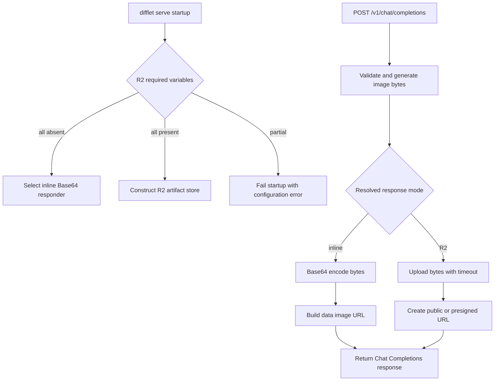

# Difflet Serving Follow-up Plan

Date: 2026-07-14

Status: Implemented and locally verified

Scope: Image serving output, serving CLI organization, benchmark wording,
TeaCache wording, and README organization.

## Research Anchor

- Repository: `/Users/clark/project/yotta/Difflet`
- Remote: `git@github.com:ai-decentralized/Difflet.git`
- Branch: `feature/serving_t2i`
- Commit: `f75e13b`
- Research date: 2026-07-14
- Research owner: Codex
- Unrelated working-tree changes observed and excluded from this plan:
  `tasks/todo.md` and `docs/design/t2v_serving/`

Findings in the Current State section are anchored to this commit and date.

## Implementation Result

Implemented on 2026-07-14. The existing `/v1/chat/completions` route now
returns a Base64 data URL when the required R2 variables are absent and keeps
returning an artifact URL when the complete R2 configuration is present.
Partial required R2 configuration fails before the serving stack is built, and
an R2 upload failure does not fall back to Base64.

The serve-command implementation now lives at `difflet/cli/serve.py`; the HTTP
server, engine, storage, and model adapters remain under `difflet/serving/`.
README setup and the authoritative serving documents describe R2 as optional.

Local verification completed with 216 serving tests and 47 focused CLI tests,
plus Black, Ruff, targeted mypy with skipped imports, `compileall`, and
`git diff --check`.

## Goal

Make `difflet serve` usable without Cloudflare R2 while retaining R2 as an
optional production artifact backend:

- When a complete R2 configuration is present, upload the generated image and
  return its remote URL in the existing Chat Completions response.
- When no R2 configuration is present, return the generated image inline as a
  Base64 data URL in the existing Chat Completions response.
- Keep `POST /v1/chat/completions` as the image-generation route.
- Do not add an `--artifact-store` CLI option for this behavior.
- Do not return local server filesystem paths.

The selection is deployment-owned and automatic. Clients receive the same JSON
shape in both modes and do not select the backend per request in this increment.

## Decisions

### 1. Chat Completions response shape

The public route is:

```text
POST /v1/chat/completions
```

Without R2 configuration, return:

```json
{
  "id": "chatcmpl-xxx",
  "created": 1701234567,
  "model": "Qwen/Qwen-Image",
  "choices": [{
    "index": 0,
    "message": {
      "role": "assistant",
      "content": [{
        "type": "image_url",
        "image_url": {
          "url": "data:image/png;base64,<base64-encoded PNG>"
        }
      }]
    },
    "finish_reason": "stop"
  }],
  "usage": {
    "prompt_tokens": 0,
    "completion_tokens": 0,
    "total_tokens": 0
  }
}
```

With R2 configured, return:

```json
{
  "id": "chatcmpl-xxx",
  "created": 1701234567,
  "model": "Qwen/Qwen-Image",
  "choices": [{
    "index": 0,
    "message": {
      "role": "assistant",
      "content": [{
        "type": "image_url",
        "image_url": {
          "url": "https://images.example.com/difflet/abc.png"
        }
      }]
    },
    "finish_reason": "stop"
  }],
  "usage": {
    "prompt_tokens": 0,
    "completion_tokens": 0,
    "total_tokens": 0
  }
}
```

Both modes keep the same Chat Completions envelope and the same
`image_url.url` field. Only the value changes:

- no R2: `data:image/png;base64,...`;
- complete R2: an HTTP(S) artifact URL.

### 2. Automatic mode selection

The server resolves the response mode once during application construction:

| R2 configuration | Selected mode | Startup behavior |
| --- | --- | --- |
| All required variables absent | Base64 data URL | Start normally |
| All required variables present and valid | R2 URL | Construct the R2 store |
| Only some required variables present | Configuration error | Fail startup with the missing variable names |

Required R2 variables remain:

```text
DIFFLET_R2_BUCKET
DIFFLET_R2_ENDPOINT_URL
DIFFLET_R2_ACCESS_KEY_ID
DIFFLET_R2_SECRET_ACCESS_KEY
```

Optional R2 variables remain:

```text
DIFFLET_R2_PREFIX
DIFFLET_R2_PUBLIC_BASE_URL
DIFFLET_R2_CLIENT_TIMEOUT
```

An empty optional value is treated as unset. Selection must not depend on
whether `.env` exists; exported process variables and the existing optional
`.env` loading path are equivalent inputs.

### 3. Failure semantics

Automatic selection is not a runtime fallback chain:

- If R2 was selected and upload or URL creation fails, return the existing
  OpenAI-style artifact/internal error JSON.
- Do not silently return Base64 after an R2 failure. Doing so hides deployment
  faults and can unexpectedly place large image data in API responses.
- Base64 encoding failures are unexpected internal failures and use the same
  public error envelope.
- Never log image bytes, Base64 payloads, access keys, secret keys, or presigned
  query strings.

### 4. R2 storage boundary

The first implementation keeps the current R2 environment contract and
`R2ArtifactStore`. R2 already uses the S3-compatible boto3 client, so the core
upload implementation remains inside the artifact-storage layer. This change
does not add an `--artifact-store` selector or rename the existing R2 variables.

### 5. Chat Completions request contract

The primary request example is:

```bash
curl -s http://localhost:8091/v1/chat/completions \
  -H "Content-Type: application/json" \
  -d '{
    "model": "Qwen/Qwen-Image",
    "messages": [
      {
        "role": "user",
        "content": "a dragon laying over the spine of the Green Mountains of Vermont"
      }
    ],
    "extra_body": {
      "height": 1024,
      "width": 1024,
      "num_inference_steps": 20,
      "guidance_scale": 4.0,
      "seed": 42
    }
  }' | jq -r '.choices[0].message.content[0].image_url.url' \
    | cut -d',' -f2- | base64 -d > dragon.png
```

Request behavior:

- The prompt continues to come from the last supported user message.
- Difflet generation controls remain inside the literal `extra_body` object for
  raw HTTP requests.
- `height` and `width` must match the active serving profile.
- The server still owns exactly one loaded model/profile; a supplied `model`
  must match that loaded model.
- Object-storage selection is not controlled by a request field.
- `response_format` does not switch between Base64 and R2.

The deployment decides:

```text
complete R2 config -> remote URL
no R2 config       -> Base64 data URL
```

## Related Agreed Changes

### Benchmark interpretation

The Qwen and Flux CLI timings in
`artifacts/cli-vs-serve-16.26.177.239.md` measure a new
`difflet generate` process for every run. They are not `difflet run` end-to-end
timings.

The measured CLI path includes:

- process startup;
- model loading;
- Neuron runtime initialization and warmup;
- inference;
- local PNG writing.

Model download and one-time AOT compilation are excluded from those generate
timings and reported separately. The resident-serving timing measures the HTTP
request through resident inference, PNG encoding, R2 upload, and URL creation;
the validation download is excluded. Documentation must retain this distinction
and must not describe the table as compile-plus-generate end to end.

### TeaCache ownership and PR wording

TeaCache was not introduced by this serving PR. The current `origin/main`
already contains the Qwen and Flux TeaCache model/pipeline implementation,
fused probes, calibration support, CLI flags, and TeaCache tests.

The integration state is more specific:

- Flux CLI already forwarded TeaCache arguments from its CLI orchestrator.
- Qwen's staged CLI exposed TeaCache flags but did not pass them into the Qwen
  generate-stage application.
- This branch wires TeaCache into resident serving and completes/adjusts the
  Qwen CLI path needed to construct the same model application.
- This branch also supports passing already-validated calibration data into the
  resident worker, instead of requiring the worker to reload deployment input
  implicitly.

README and PR text must therefore say "wire" or "expose existing TeaCache in
serving/Qwen CLI," not "add TeaCache to Qwen and Flux." Serving TeaCache must
not be presented as benchmark-validated unless the relevant calibrated profile
has actually passed its focused tests and Trainium smoke run.

### Consolidate the serve command under `difflet/cli`

The `difflet serve` command implementation should move from
`difflet/serving/cli/serve.py` to `difflet/cli/serve.py`.

The ownership boundary after the move is:

| Module | Responsibility |
| --- | --- |
| `difflet/cli/main.py` | Top-level parser, shared CLI validation, and command dispatch |
| `difflet/cli/serve.py` | Serve-command argument validation, logging setup, stack startup, and uvicorn launch |
| `difflet/serving/` | Serving registry, factory, engine, HTTP handlers, storage, and model adapters |

Only the command-line entry implementation moves. Serving runtime code remains
under `difflet/serving/`; it should not be merged into the offline CLI
orchestrators.

### README order and setup

The top-level usage order should be:

1. Quick start, with Python API as a subsection
2. Serving
3. CLI reference

The basic installation and Serving quick start must not require this step:

```bash
cp .env.example .env
```

Without R2 configuration, `image_url.url` contains a Base64 data URL, so a user
can call the service and save or display the image entirely on the client. The
README should use the `jq | cut | base64 -d` command above as its primary
example. R2 configuration is documented afterward as an optional deployment
integration for durable or shareable URLs.

## Current State

The current branch has the following behavior:

- `ServeOptions.artifact_store` defaults to `"r2"`.
- Application construction creates `R2ArtifactStore` unless tests or callers
  explicitly select/inject `MemoryArtifactStore`.
- Missing R2 credentials therefore prevent normal serving startup.
- `generate_chat_completion(...)` always calls `put_bytes(...)`, then
  `get_url(...)`, and returns the resulting URL.
- The README describes R2 setup as mandatory.
- The authoritative serving design says data URLs are outside P0 and R2 URLs
  are mandatory.

Primary source locations:

| Concern | Current source |
| --- | --- |
| Store protocol and R2 implementation | `difflet/serving/artifact_store.py:65` |
| Store selection at app construction | `difflet/serving/openai/api_server.py:87` |
| Upload and response serialization | `difflet/serving/openai/serving_chat.py:216` |
| Serving options | `difflet/serving/options.py:77` |
| Current serve command implementation | `difflet/serving/cli/serve.py` |
| Target serve command implementation | `difflet/cli/serve.py` |
| Public setup instructions | `README.md:100`, `README.md:171`, `.env.example` |
| Authoritative API contract | `docs/design/difflet_serving/chat_completions_contract.md` |
| Authoritative serving architecture | `docs/design/difflet_serving/architecture.md` |

## Target Request Flow



Mode selection belongs to the parent HTTP process. The resident engine and
stage pipeline continue to return `DiffletGenerateOutput` bytes and remain
independent of R2, Base64, HTTP response formatting, and object retention.

## Implementation Plan

### Phase 1: Represent the selected response mode

- Remove the public/internal `artifact_store="r2"` default as the condition
  that makes R2 mandatory.
- Add one explicit resolved image-response policy or equivalent application
  dependency with two states: inline and artifact URL.
- Resolve that dependency at application construction, not once per request.
- Preserve explicit artifact-store injection for unit tests.
- Validate partial R2 configuration before model/worker startup where possible,
  so configuration errors fail quickly without loading the model.

Acceptance criteria:

- A machine with no `DIFFLET_R2_*` variables can construct and start the app.
- A partial required configuration fails deterministically and lists missing
  variables.
- A complete configuration constructs exactly one reusable R2 client/store.

### Phase 2: Add inline image serialization

- Add a small helper that converts `(mime_type, bytes)` into
  `data:<mime_type>;base64,<payload>` using standard Base64 encoding.
- Keep serialization in the OpenAI serving layer; do not put it in the engine,
  model adapter, or stage payload types.
- Refactor `generate_chat_completion(...)` so the post-generation output path
  has two explicit branches:
  - inline branch: populate `image_url.url` with the data URL;
  - R2 branch: retain the current bounded upload and URL generation path.
- Keep the final Chat Completions response builder shared between both branches.

Acceptance criteria:

- The decoded bytes from an inline response exactly equal the engine output.
- Inline `image_url.url` starts with `data:image/png;base64,`.
- The response envelope is otherwise identical between inline and R2 modes.

### Phase 3: Preserve R2 retention behavior

- Keep private R2 mode returning a presigned S3 API URL whose expiry uses
  `artifact_ttl_seconds`.
- Keep public/custom-domain mode returning the configured public URL and relying
  on the bucket lifecycle policy for deletion.
- Document that public-domain lifecycle deletion and CDN invalidation are not
  strict second-level URL expiry.
- Keep upload and presign timeout handling unchanged unless tests identify a
  defect.

Acceptance criteria:

- Existing private presigned and public custom-domain tests continue to pass.
- `artifact_ttl_seconds` is not described as expiring a public custom-domain
  URL.

### Phase 4: Update documentation and examples

- Keep the top-level README flow as Quick start, Serving, then CLI reference;
  keep Python API inside Quick start.
- Make basic serving startup independent of `.env`, boto3 credentials, and
  Cloudflare setup.
- Keep `/v1/chat/completions` and use the `dragon.png` decode command as the
  primary image-serving example.
- Show the `image_url.url` Base64 data URL as the default no-configuration
  behavior.
- Move R2 instructions under an optional production/object-storage section.
- Explain that `.env.example` is a template only for optional R2 integration.
- State that CLI benchmark rows use `difflet generate`, exclude compilation,
  and include fresh-process model/runtime initialization.
- Correct TeaCache wording so the PR is described as integration/wiring, not as
  introducing Qwen/Flux TeaCache.
- Update both authoritative serving documents to replace the mandatory-R2
  contract; do not leave the old P0 statements in place.

Acceptance criteria:

- A new user can run the documented serving quick start without creating
  `.env`.
- R2 remains fully documented but is clearly optional.
- README and authoritative design documents describe the same response policy.

### Phase 5: Move the serve CLI implementation

- Move `difflet/serving/cli/serve.py` to `difflet/cli/serve.py`.
- Update `difflet/cli/main.py`, package exports, imports, and tests to use the
  new path.
- Keep FastAPI construction, serving factories, engines, artifact handling, and
  model adapters under `difflet/serving/`.
- Remove the obsolete `difflet/serving/cli/` package when no callers remain.

Acceptance criteria:

- `difflet serve --help` and serve argument validation remain unchanged.
- No imports of `difflet.serving.cli` remain.
- CLI and serving unit tests pass with the new module path.

### Phase 6: Verification

Add or update unit coverage for:

1. No R2 variables: app selects inline mode.
2. Complete R2 variables: app selects R2 mode.
3. Each partial R2 configuration: startup rejects it and reports missing keys.
4. Inline response: `image_url.url` has the correct data-URL prefix.
5. Inline response: decoded data URL is byte-for-byte equal to generated PNG
   data.
6. R2 response: upload and URL generation occur once and return an HTTP(S) URL.
7. R2 response: the HTTP(S) URL is returned in the same `image_url.url` field.
8. Configured R2 upload failure: no Base64 fallback; unified JSON error remains.
9. Configured R2 presign failure: no Base64 fallback; unified JSON error remains.
10. Public custom domain and private presigned URL retention behavior remains
   covered.
11. Logs identify the selected mode and timings without logging artifact data or
    credentials.

Run the focused serving tests and formatting/lint checks. On the Trainium remote
host, smoke test at least one supported image model in both modes:

- no R2 configuration -> decode `image_url.url` and verify it is a valid PNG;
- complete R2 configuration -> fetch the returned URL and verify it is a valid
  PNG.

The model output for the two requests does not need to be identical unless all
generation inputs, seed, compiled artifact, and runtime behavior are held fixed.

## Operational Notes and Risks

- Base64 increases encoded payload size by roughly one third and increases API
  process memory while building the JSON response. This is accepted for the
  current image-serving MVP.
- Reverse proxies and API gateways must allow response bodies large enough for
  the configured image size and format.
- Inline responses avoid persistent artifacts but may still be retained in
  client, proxy, or application logs if those systems log response bodies.
- Complete-looking R2 configuration does not prove credentials, endpoint, or
  bucket permissions are valid, so the upload path must retain clear bounded
  errors.
- The server should log the selected response mode once at startup, for example
  `image_response_mode=inline` or `image_response_mode=r2`, without logging
  secrets.
